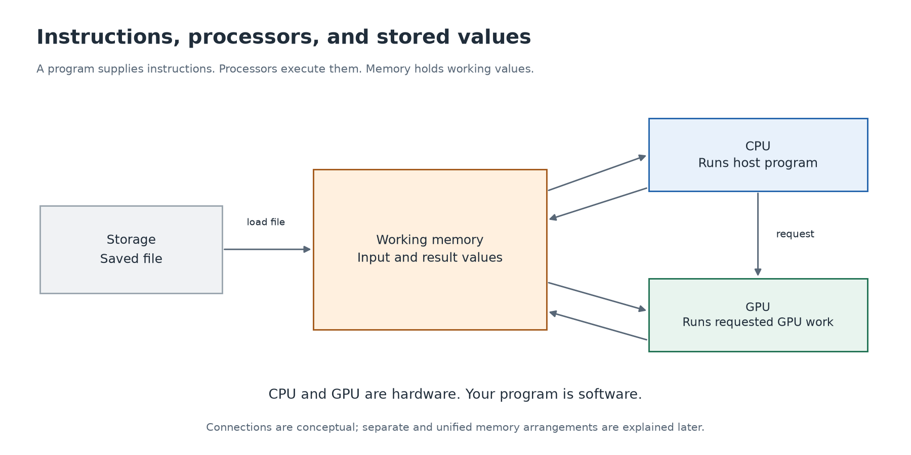

# 1. Computer parts

[Guide](../README.md) · [Next: pixels →](02-pixels.md)

## Instructions and the machine that follows them

A **program** is a set of instructions for a computer. Some instructions calculate values; others read or write memory, compare values, or choose what to do next. The program may be written in a language such as Python or C++, but hardware ultimately executes machine instructions.

A **processor** is hardware that carries out instructions. It contains circuits for calculation and control. A **chip** is a physical piece of silicon containing electronic circuits. One chip can contain several kinds of processor.

The **CPU**, or central processing unit, runs the operating system and ordinary application instructions. The operating system is software such as macOS, Windows, or Linux that manages the computer's resources. In our examples, the CPU starts the program and coordinates any GPU work.

The **GPU**, or graphics processing unit, is another kind of processor. It is built to handle large collections of suitable work efficiently, such as many related calculations on different pieces of data. We will make “suitable” concrete rather than assuming everything runs faster on a GPU.

## The places values are stored

**Memory**, usually called RAM in everyday computer specifications, holds values and instructions needed by running programs. **Storage**, such as an SSD, keeps files between sessions. Saving a photo to an SSD and holding that photo's pixels in RAM are different steps.

Processors also have smaller nearby storage, including **registers** for immediate working values and **caches** that retain useful data. You do not need to memorize their sizes. The first idea is that doing arithmetic and obtaining the numbers for that arithmetic are separate jobs.

Imagine brightening a saved photo:

1. The program reads the file from storage.
2. Software turns its contents into working image data in memory.
3. The CPU performs a calculation itself or requests suitable work from the GPU.
4. Results are available for display or saving once the calculation is complete.

This is a simplified workflow. Actual image formats, decoding, display composition, and memory systems add details. The point is to distinguish the saved file, working data, and hardware doing calculations.

## GPUs and graphics cards

People sometimes use the words interchangeably, but there is a distinction. A **graphics card** is a board that commonly contains a GPU chip, memory, power circuitry, connectors, and cooling. The GPU is the processor on that board.

A GPU can also be integrated into the same chip as a CPU. This is common in laptops, including Apple Silicon Macs. **Integrated** does not mean imaginary or simulated: it is still real GPU hardware. **Discrete** usually means a separate GPU device, often with its own memory.

A **system on a chip**, often shortened to SoC, puts several system components together. An Apple M3 Pro contains CPU and GPU components, among others. Its CPU and GPU remain different execution resources even though they are part of one chip. Apple's [M3 family description](https://www.apple.com/newsroom/2023/10/apple-unveils-m3-m3-pro-and-m3-max-the-most-advanced-chips-for-a-personal-computer/) identifies these components.

## CPU and GPU cooperation

In the programs you will learn here, both have jobs. The CPU opens the application, manages its broader logic, and submits GPU work. The GPU carries out requested calculations. The GPU's ability to calculate does not mean it independently opens your source file and decides which parts to accelerate.

Optional review

Label each as hardware or software: CPU, GPU, Python, CUDA, SSD, macOS. Hardware: CPU, GPU, SSD. Software: Python, CUDA, macOS.

Explain how “a program,” “a processor,” and “memory” differ. Then explain why a computer can have a GPU even if it has no separate graphics card.

