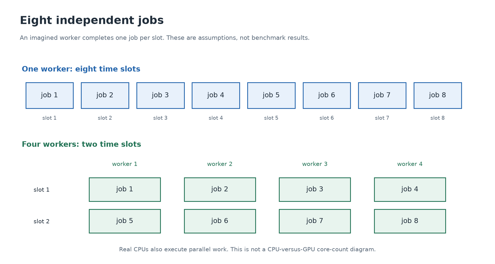

# 3. Doing several pieces of work at once

[← Pixels](02-pixels.md) · [Next: memory →](04-memory.md)

## Separate the rule from each job

Suppose we want to double eight numbers:

```text
input:   1  2  3  4  5  6  7  8
output:  2  4  6  8 10 12 14 16
```

The rule is “multiply by two.” Each input creates one job. **Sequential** work handles jobs one after another. **Parallel** work allows some jobs to progress at the same time using available execution resources.

Picture one worker who completes one job per time slot. Eight jobs take eight slots. With four workers who each complete one job per slot, the same eight independent jobs take two slots under these invented assumptions.



This drawing is an arithmetic model. It is not a drawing of CPU or GPU cores, and the time slots are not measured seconds. Real CPUs can also execute work in parallel. A CPU is not limited to one worker, and a GPU is not literally four workers.

## CPU and GPU design priorities

CPUs are built to handle varied program behavior efficiently, including complex decisions and instruction sequences with dependencies. GPUs place substantial emphasis on completing large amounts of suitable parallel work. They organize execution and memory resources differently.

“CPU cores” and “GPU cores” are therefore not directly interchangeable counting units. A GPU advertised with thousands of arithmetic units does not necessarily execute an ordinary application thousands of times faster than a CPU. You need to know the work, memory behavior, software implementation, and timing scope.

**Latency** is the time for one requested task to finish. **Throughput** is how much work finishes per unit time. A GPU can have high throughput on a large batch while a CPU finishes a very small request sooner.

## Some jobs depend on earlier answers

Consider this rule instead:

```text
Start with 1.
The next value is twice the previous value.
Repeat until you have eight values.
```

It produces `1,2,4,8,16,32,64,128`. In this direct procedure, computing the next value requires the previous answer. Assigning all steps to different workers does not make the missing answers available immediately.

Sometimes a different algorithm can expose parallelism—for this particular example, each value can also be expressed using a power of two. The lesson is to identify dependencies and, if necessary, change the algorithm. “Use more workers” by itself is not an algorithm.

## Starting the work also costs time

Asking a GPU to work involves preparing data and submitting a request. Some systems also require copying data into separate GPU memory. These costs can dominate a small calculation.

Invented example: a CPU calculation takes 5 time units. A GPU calculation takes 1, but preparation and transfers take 10. The GPU route totals 11. Its arithmetic stage was faster, yet the whole task took longer.

Larger batches, more work per transferred value, and keeping data available for several GPU operations may improve the tradeoff. Actual measurements decide whether an application benefits.

## Try the work-assignment model

From the repository root:

```sh
python3 cuda/foundations/experiments/02_work.py
```

The [program](../experiments/02_work.py) prints which imagined worker handles each job in each round. It executes the model on the CPU in ordinary Python; it does not start parallel workers or emulate a GPU. It checks that every job gets exactly one owner.

<details>
<summary>Optional review</summary>

Ten independent jobs, four workers, at most one job per worker per round. How many rounds? Three; the last round has two jobs. This leftover work is the beginning of the “partial block” issue you will encounter in CUDA.

Explain why independent image pixels are promising parallel work, why a dependency can limit that work, and why faster arithmetic may still produce a slower end-to-end task.

</details>
