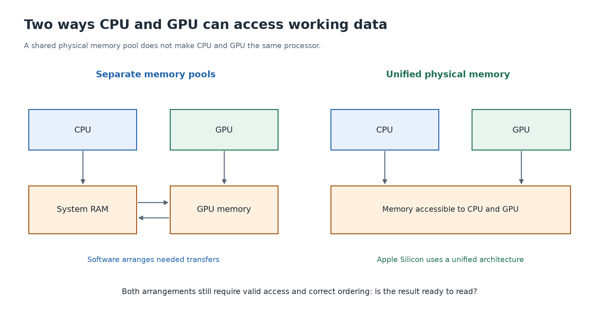

# 4. Before adding numbers, find the numbers

[← Parallel work](03-parallel-work.md) · [Next: CUDA and software →](05-cuda-and-software.md)

## Values need a location

Take `3 + 4 = 7`. A program must have representations of 3 and 4 available, execute the addition, and store or use 7. The **value** is the number; its **address** identifies where it is stored. Knowing the address is different from reading the stored value.

The numbers are represented by bits. A **bit** can hold 0 or 1; a **byte** consists of eight bits. A format defines what a sequence of bits means. In the later CUDA labs, one floating-point value occupies four bytes. Four such values occupy sixteen bytes.

Moving a number between memory regions copies its representation. It does not itself perform the addition or make the destination's processor start calculating.

## Two common arrangements

Many computers with a separate GPU have CPU-accessible system RAM and separate GPU memory. GPU memory is often called **VRAM** in device specifications. The CPU prepares data, and software arranges a transfer so the GPU can access what it needs efficiently. After computing, results may be copied back.

Other systems, including Apple Silicon, use **unified memory** that CPU and GPU components can access. Sharing the physical memory pool can avoid some copying between separate pools. The CPU and GPU still need appropriate access to resources and must respect when results are ready. Apple's [M3 overview](https://www.apple.com/newsroom/2023/10/apple-unveils-m3-m3-pro-and-m3-max-the-most-advanced-chips-for-a-personal-computer/) describes this shared architecture.

These are conceptual arrangements, not exhaustive circuit diagrams. **Unified physical memory** and CUDA's named **Unified Memory** software feature are related ideas at different levels; do not assume every use of “unified” specifies the same hardware or movement behavior.

## Sharing memory does not mean finishing together

Suppose the GPU is producing a list of answers. The CPU must know that the GPU has finished before it reads those answers. Otherwise it might observe old or incomplete data.

**Synchronization** means establishing the required ordering or completion. In this example, the CPU waits until the GPU's work is finished. That remains necessary even when both processors can access the same physical memory.

An everyday comparison is two people editing a shared worksheet: being able to see the same sheet does not mean one person's calculation is already finished. In a program, this ordering must be established through the programming system's rules.

## Faster storage has limited space

Registers hold working values close to calculation units. Caches retain data to avoid some repeated trips to larger memory. GPUs also expose certain fast storage for explicitly coordinated work; CUDA calls one such region **shared memory**.

CUDA shared memory is a small cooperation resource for a group of GPU threads. It is not another name for the Mac's system-wide unified memory. We will teach its exact scope when the CUDA code needs it.

**Capacity** asks how many bytes fit. **Bandwidth** asks how many bytes can be moved per unit time. **Latency** asks how long a request takes. A large memory capacity does not by itself imply fast transfers or short waits.

## Trace one complete calculation

For a separate-memory model, say each step aloud: “CPU prepares inputs; inputs become available in GPU memory; CPU requests the operation; GPU reads, adds, and stores; completion is established; results return to the CPU if needed.”

For a unified-memory model, some transfers may be unnecessary, but preparing data, submitting work, executing arithmetic, and establishing completion still matter.

Optional review

Explain why an address is not its stored value, why sharing RAM does not turn a GPU into a CPU, and why the time to calculate one addition is not the whole cost of using a GPU.

