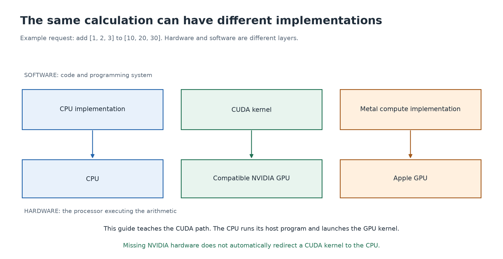

# 5. Where CUDA fits, and what runs on the CPU

[← Memory](04-memory.md) · [Next: your machine →](06-your-machine.md)

## Keep the layers separate

**Hardware** is the physical machinery. **Software** supplies instructions and organizes its use. A CPU and GPU are hardware. A program, compiler, driver, and programming library are software.

A **compiler** translates source code into another representation, often machine instructions. A **driver** is system software that helps applications use a device. A **library** provides operations other programs can call. A **framework**, such as PyTorch, supplies a broader collection of tools for building programs.

**CUDA** is NVIDIA's platform and programming model for using compatible NVIDIA GPUs. It includes programming interfaces, runtime support, development tools, and libraries. **CUDA C++** is the way this guide writes CUDA programs using C++ plus GPU-specific extensions. The C++ source is not itself a physical GPU.



## A CUDA application has two sides

The **host** side runs on the CPU. A **kernel** is a function launched to execute on the GPU, the **device**. In these lessons, “kernel” means GPU function; it is a different use of the word from “operating-system kernel.”

For adding two arrays, the host prepares the inputs, makes them available to the GPU, launches the kernel, and obtains the completed result. GPU threads execute the kernel's arithmetic. Launching means submitting the request; it does not mean the CPU itself executes all the GPU instructions. These roles are defined in NVIDIA's [programming model](https://docs.nvidia.com/cuda/cuda-programming-guide/01-introduction/programming-model.html).

Here is the sequence in plain language, before any CUDA syntax:

```text
CPU: prepare [1, 2, 3] and [10, 20, 30]
CPU: arrange for the NVIDIA GPU to access those arrays
CPU: request "add matching elements"
GPU: calculate [11, 22, 33]
CPU: wait for the required completion and use the result
```

The CPU is doing real work in this program. That does not mean the GPU kernel runs on the CPU.

## Four different meanings of “run on a CPU”

| Activity | Execution |
| --- | --- |
| Running the host portion of a CUDA application | The CPU executes this code, including requests for GPU work. |
| Calculating the same additions on a CPU | A separate CPU implementation uses ordinary CPU instructions. |
| Running a CUDA kernel without a compatible GPU | Standard CUDA does not automatically fall back to the CPU. |
| Reading or editing CUDA source | Possible without an NVIDIA GPU. Compilation needs suitable tools; testing device execution needs compatible hardware. |

This is why the existing CPU labs work on your Mac. They are separate CPU examples with similar mathematics. Their success verifies the CPU example, not the NVIDIA GPU code.

## Choosing a processor in PyTorch

PyTorch provides operations such as adding numeric arrays, called **tensors**. It can route supported operations through different implementations, often called **backends**.

For the hardware paths used in this guide:

- `cpu` means use the CPU implementation.
- `cuda` means use the NVIDIA CUDA path on compatible NVIDIA hardware.
- `mps` means use PyTorch's Apple GPU path through Apple's Metal stack.

The Python expression can look similar while the underlying implementation and processor change. Choosing `cpu` is not an instruction to emulate CUDA. Choosing a GPU device also requires compatible hardware, software, and operation support. See PyTorch's [CUDA](https://docs.pytorch.org/docs/stable/notes/cuda.html) and [MPS](https://docs.pytorch.org/docs/stable/notes/mps.html) documentation.

In the CUDA labs, we explicitly launch the GPU code and check the result. An unavailable CUDA device is reported as a problem rather than silently replacing the kernel with CPU work.

## CUDA is not the only way to program a GPU

Apple's **Metal** provides graphics and compute interfaces for Apple GPUs. Other hardware and software ecosystems have their own interfaces. You do not need to learn all of them now. First understand the common ideas: independent work, data location, submission, and completion.

CUDA-specific syntax is a later layer. Learning the GPU ideas remains useful even when you use a different programming system.

<details>
<summary>Optional review</summary>

Explain how both “a CUDA application uses the CPU” and “a CUDA kernel needs its GPU execution path” can be true. Then explain why running a tensor operation with `device='cpu'` is not evidence of CUDA executing on the CPU.

</details>
