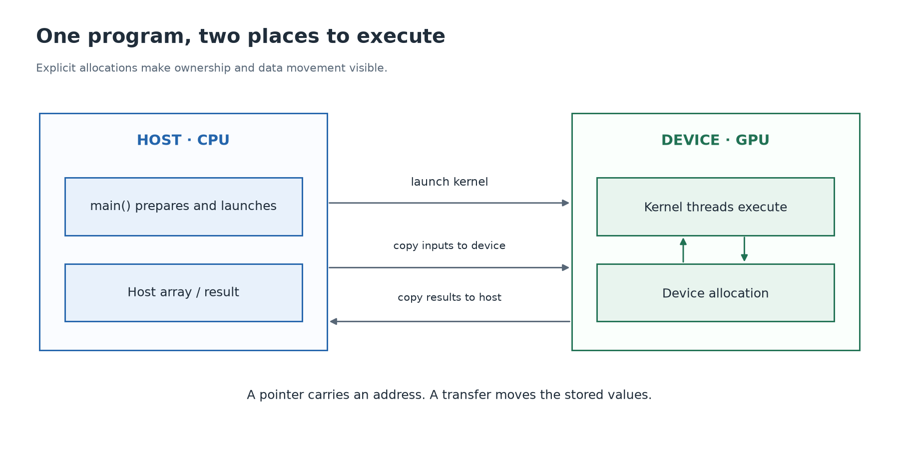

# 4. Ask the GPU to write one number

[← Parallelism](03-parallelism.md) · [Next: indexing →](05-indexing.md)

**Build today:** a complete CPU → GPU → CPU round trip. Open [01_first_kernel.cu](../labs/gpu/01_first_kernel.cu). You can trace it on paper before you have a GPU.

## Host and device

The **host** is the CPU side of the CUDA program. The **device** is the GPU side. `main()` runs on the host. A **kernel launch** asks the device to execute a function across a specified collection of threads.



Our early examples use explicit device allocations. A device pointer is an address for the device's allocation. Passing that pointer to a kernel passes the address, not a copy of the allocation's contents. The CPU must not ordinarily dereference a pointer returned by `cudaMalloc`. More advanced shared/managed memory arrangements exist; this guide establishes the explicit model first.

## The smallest useful kernel

```cpp
__global__ void write_answer(int* answer) {
    *answer = 42;
}
```

`__global__` marks a function that can be launched as a CUDA kernel and executes on the device. `void` means the kernel does not return an ordinary function result to the CPU. Instead, it stores its result through `answer` into device-accessible memory.

Here the operand `42` is a literal constant. `answer` holds an address. `*answer = 42` writes the number to the location, rather than changing which address `answer` holds.

Other function annotations you will encounter are `__device__` for a function callable from device code and `__host__` for host code. Ordinary unannotated C++ functions are host functions. Some small functions can be compiled for both using `__host__ __device__`; not every host library operation is usable on a GPU.

## Follow the complete lifecycle

The source uses `CUDA_CHECK` around runtime calls. This helper checks their return status and reports the failing expression and CUDA error. Read it as “perform this call, and stop if it fails.”

```cpp
int host_answer = 0;
int* device_answer = nullptr;
CUDA_CHECK(cudaMalloc(reinterpret_cast<void**>(&device_answer), sizeof(int)));
CUDA_CHECK(cudaMemcpy(device_answer, &host_answer, sizeof(int), cudaMemcpyHostToDevice));

write_answer<<<1, 1>>>(device_answer);
CUDA_CHECK(cudaGetLastError());
CUDA_CHECK(cudaDeviceSynchronize());

CUDA_CHECK(cudaMemcpy(&host_answer, device_answer, sizeof(int), cudaMemcpyDeviceToHost));
CUDA_CHECK(cudaFree(device_answer));
```

Read each step literally:

1. Create a CPU integer and an empty pointer variable.
2. `cudaMalloc` reserves enough device bytes for one integer. It writes the allocated address into `device_answer`, which is why we pass the address of the pointer variable. The cast adapts `int**` to the runtime's generic `void**` output parameter.
3. `cudaMemcpy` copies the initial zero from host to device. Its arguments are destination, source, byte count, and direction. Device allocation alone does not initialize contents.
4. `<<<1, 1>>>` requests one block containing one thread. That thread writes 42.
5. `cudaGetLastError` checks launch errors. `cudaDeviceSynchronize` waits for device work and checks execution errors.
6. Copy the result back into `host_answer`.
7. Free the device allocation once it is no longer in use.

The blocking device-to-host copy would also wait for the preceding same-stream work in this example. The explicit synchronization makes the learning sequence and execution-error check visible. Later we remove unnecessary waits when constructing pipelines.

## A launch is not an ordinary function call

`write_answer<<<1, 1>>>(device_answer)` normally returns control to the CPU before the GPU finishes executing the kernel. This is **asynchronous execution**. Code appearing later on the CPU is not automatically proof that the GPU result is ready.

The host and device execute different instruction sets. `nvcc` handles the CUDA source and invokes a host compiler for the CPU parts. CUDA compilation may produce GPU machine code and/or an intermediate representation called PTX, depending on build options. A `.cu` suffix tells the CUDA build which source it is compiling; an ordinary C++ compiler does not understand launch syntax by itself.

On your NVIDIA machine:

```sh
make build/gpu/01_first_kernel
./build/gpu/01_first_kernel
```

The expected line is `PASS: first kernel wrote 42`. For a direct build after `build/` exists:

```sh
nvcc -std=c++17 -O2 -lineinfo -Iinclude labs/gpu/01_first_kernel.cu -o build/first_cuda
./build/first_cuda
```

## Helpers in subsequent labs

[02_vector_add.cu](../labs/gpu/02_vector_add.cu) keeps allocation and copies explicit for three arrays. Later examples use [DeviceBuffer](../include/common.cuh) to own an allocation. `upload` copies host input; `download` returns copied host output; `poison` fills output with NaNs so missed writes cannot look successful. `finish_kernel` checks a launch and synchronizes.

These are local teaching helpers, not CUDA API names. They deliberately assume nonempty allocations and small supported sizes. Read their source after the explicit version makes sense.

**Experiment:** change 42 to 84 in the kernel and update the host expectation. Then identify why changing the launch to many threads all writing the same address is unnecessary and introduces conflicting writes.

<details>
<summary>Optional review</summary>

Distinguish the pointer, its allocation, the copied bytes, the launch, and completion. Explain why the integer observed by the CPU changes only after the result is copied back.

</details>

Source for the runtime workflow: NVIDIA's [introduction to CUDA C++](https://docs.nvidia.com/cuda/cuda-programming-guide/02-basics/intro-to-cuda-cpp.html).
