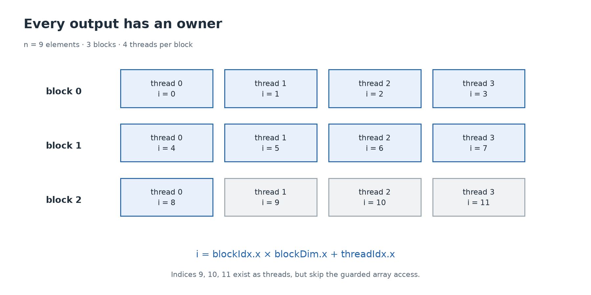

# 5. Give every thread its own work

[← First kernel](04-first-kernel.md) · [Next: GPU execution →](06-execution.md)

**Build today:** vector addition, then a loop that covers more elements than there are launched threads. Run [the CPU indexing lab](../labs/cpu/02_indexing.cpp) even if you do not have CUDA hardware.

## Threads have coordinates

A **grid** is the collection of blocks in one kernel launch. A **block** groups threads that can cooperate using block synchronization and shared memory. Every thread executes the kernel's code with its own identity.

In a one-dimensional launch:

| Built-in value | Meaning |
| --- | --- |
| `threadIdx.x` | This thread's position within its block, starting at zero. |
| `blockIdx.x` | This block's position within the grid, starting at zero. |
| `blockDim.x` | Number of threads per block along x. |
| `gridDim.x` | Number of blocks in the grid along x. |

If each block has four threads, block 0 handles positions 0–3, block 1 handles 4–7, and so on. That gives:

```cpp
int i = blockIdx.x * blockDim.x + threadIdx.x;
```

The multiplication skips complete earlier blocks; the addition chooses a thread inside this block. This is arithmetic ownership, not a promise that blocks execute in index order.



## Tail threads are normal

For `n=9`, four threads per block need three blocks. Twelve threads launch; only nine should write. Each extra thread still exists but takes the false branch:

```cpp
__global__ void vector_add(const float* a, const float* b, float* c, int n) {
    int i = blockIdx.x * blockDim.x + threadIdx.x;
    if (i < n) c[i] = a[i] + b[i];
}
```

With positive `n` and `threads`, the block count is rounded up:

```cpp
int blocks = (n + threads - 1) / threads;
vector_add<<<blocks, threads>>>(a, b, c, n);
```

For 9 and 4, `(9 + 4 - 1) / 4 = 3`. Plain `9 / 4 = 2` would leave the last element untouched. The addition-based ceiling formula is safe for our small sizes; with large integer sizes, guard overflow or use quotient and remainder.

A zero-element input is handled on the host by doing no work; do not launch a zero-block grid. Our GPU lab contracts use positive sizes. The CPU ownership model includes zero to show that it needs no owners.

## Prove coverage and uniqueness

For each valid `i`, dividing by `threads` yields a block index and remainder:

```text
block = i / threads
thread = i % threads
```

That pair reconstructs `i` and is unique. Therefore every output has exactly one writer, provided the grid rounds up and the kernel guards the tail. The inputs are read-only and outputs are separate, so there is no communication needed between threads.

Run the arithmetic model:

```sh
make build/cpu/02_indexing
./build/cpu/02_indexing
```

It checks that every element is owned exactly once over multiple sizes. It enumerates identities sequentially on the CPU; it does not reproduce GPU execution timing or races.

## More work than threads: grid-stride loops

SAXPY is a traditional name for scaling one vector and adding another: `out[i] = alpha * x[i] + y[i]`. In our version, inputs and output are separate arrays. For `alpha=2`, `x=[1,2]`, `y=[10,20]`, the result is `[12,24]`.

One thread can handle several indices:

```cpp
int start = blockIdx.x * blockDim.x + threadIdx.x;
int stride = blockDim.x * gridDim.x;
for (int i = start; i < n; i += stride) {
    out[i] = alpha * x[i] + y[i];
}
```

For two blocks of four threads, there are eight starting identities. Thread identity 2 handles indices 2, 10, 18, … . Identity 3 handles 3, 11, 19, … . At each iteration, neighboring identities still access neighboring elements. Each index belongs to one remainder class modulo eight.

The grid size no longer has to grow with `n`. Choosing a good grid size is a performance decision; the stride loop preserves coverage as long as the launch is valid and arithmetic stays in range.

## Two-dimensional coordinates

Matrices naturally use row and column. `dim3` holds x, y, and z dimensions; unspecified dimensions default to one:

```cpp
dim3 threads(16, 16);
dim3 blocks((cols + 15) / 16, (rows + 15) / 16);
// Inside a matching kernel:
int col = blockIdx.x * blockDim.x + threadIdx.x;
int row = blockIdx.y * blockDim.y + threadIdx.y;
```

That block has `16 × 16 = 256` threads, not 16. A two-dimensional launch does not force memory to be physically two-dimensional; [lesson 7](07-memory.md) derives the address calculation.

## Implement E01 and E02

Fill the first two functions in [exercises/kernels.cuh](../exercises/kernels.cuh). On CUDA hardware:

```sh
make student LAB=02_vector_add
make student LAB=03_grid_stride
```

The vector test includes values just before and after warp/block boundaries. The SAXPY test intentionally launches only 256 threads for as many as 65,537 elements. A kernel that processes only one element per thread must fail that test.

<details>
<summary>Optional review</summary>

For `n=1003` and 256 threads per block, compute the grid size and number of unused tail threads. Then identify the thread owning element 700. Answer: 4 blocks, 21 tail threads; block 2, thread 188.

</details>

Primary reference: NVIDIA's [thread indexing and SIMT kernels](https://docs.nvidia.com/cuda/cuda-programming-guide/02-basics/writing-cuda-kernels.html).
