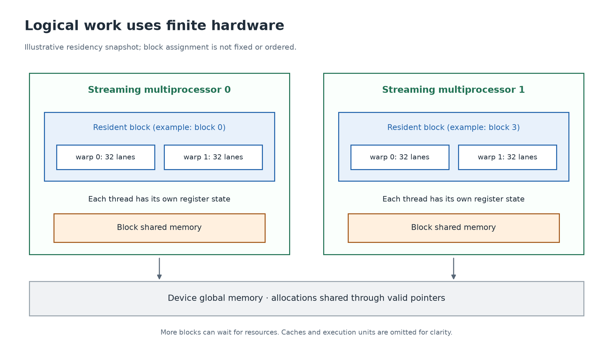

# 6. From CUDA threads to GPU execution

[← Indexing](05-indexing.md) · [Next: memory →](07-memory.md)

**Investigate today:** why a million launched threads do not require a million physical arithmetic units, and why correct code cannot assume a particular block schedule.

## Three different levels

| Level | What it describes |
| --- | --- |
| Thread, block, grid | The work you request through CUDA. |
| Warp | A group of 32 threads within a block used in execution. |
| Streaming multiprocessor (SM) | Hardware that holds resident thread state and executes instructions. |

A normal block is assigned to one SM for execution. An SM can have multiple blocks resident when resources permit. A grid can contain far more blocks than can be resident at once; later blocks run as resources become available. The block's number does not tell you its SM or its start time.



An SM contains execution units, registers, scheduling machinery, and on-chip memory resources. A marketed “CUDA core” is not a complete CPU core and is not a permanent home for one CUDA thread. Different instruction types use different execution units, and implementation details vary by architecture.

## Warps and lanes

Within a block, thread identities are linearized with x varying fastest. A `16 × 16` block has linear index `threadIdx.y * 16 + threadIdx.x`; its first warp spans two rows of 16 threads. A **lane** is a thread's position within its warp, from 0 through 31. Blocks never share a warp.

The SIMT model, “single instruction, multiple threads,” lets you write an individual thread's program. Hardware executes instructions for participating lanes, with a separate set of data values for each lane. A warp's instruction is not a promise that every operation finishes in one clock tick.

## Branch divergence

Consider:

```cpp
if (threadIdx.x % 2 == 0) {
    // One path.
} else {
    // A different path.
}
```

Within a one-dimensional warp, even and odd lanes choose different paths. Execution must account for both paths, using active lanes appropriate to each. That can reduce useful lane utilization. If every thread in a warp takes the same path, there is no within-warp divergence from that branch.

The bounds guard `if (i < n)` is still necessary. It usually affects only the final partial warp for contiguous one-dimensional work. Removing a safety condition to avoid a small tail cost makes the program incorrect.

Do not use a presumed lockstep warp execution as synchronization. Architectures with independent thread scheduling make such assumptions especially unsafe. Use the documented barriers, masks, and warp collectives when threads exchange information.

## Registers and latency hiding

Each thread needs state: its indices, operands, loop values, and partial sums. The compiler tries to keep much of this in **registers**. More live per-thread state can increase register use. Registers and shared memory are finite resources on each SM.

When a warp is waiting for an operand, an SM can issue work from another ready warp. This is **latency hiding**: keeping execution resources useful while some work waits. It does not make the original memory request complete sooner. It also cannot exceed the memory system's sustainable bandwidth.

**Occupancy** is the ratio of resident warps to the architectural maximum resident warps on an SM. Thread count, block limits, register use, and shared memory use all constrain it. High occupancy can help expose ready work, but maximizing it is not a universal optimization objective. More data reuse with somewhat lower occupancy may win; only measurements can decide.

As a hypothetical resource calculation, if an SM had 65,536 32-bit registers and every thread used 64, register capacity alone would allow at most 1,024 such threads. Real occupancy also depends on allocation granularity and other device limits. This is arithmetic practice, not a specification for every GPU.

## Launch limits are real

[00_device.cu](../labs/gpu/00_device.cu) prints actual device properties. The total threads per block must respect the device and kernel limits, along with per-axis limits and available shared memory. “Make the block as large as possible” is not a general tuning rule.

Our initial one-dimensional blocks use 128 or 256 threads, and matrix blocks use 16×16. Those are readable starting configurations, not a claim of optimal performance. The reduction explicitly requires a power-of-two thread count because of its tree algorithm.

**Exercise:** a one-dimensional block of 100 threads occupies four warps, with only four participating threads in the last warp. A block of 96 occupies three full warps. Neither fact alone tells you which launch runs an entire application faster.

**Checkpoint:** distinguish a logical thread from a physical execution unit, a block from an SM, and occupancy from measured speed. Explain why block 1 cannot wait indefinitely for block 0 to run first.

Reference: NVIDIA's [programming and hardware model](https://docs.nvidia.com/cuda/cuda-programming-guide/01-introduction/programming-model.html).
