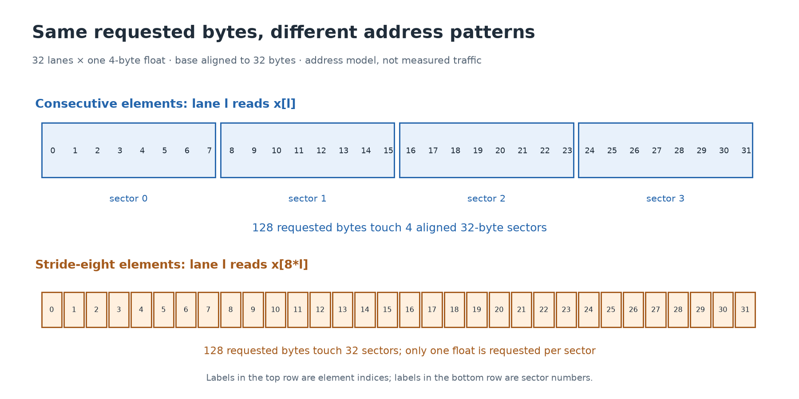

# 7. Memory is part of the algorithm

[← Execution](06-execution.md) · [Next: synchronization →](08-synchronization.md)

**Build today:** turn a matrix coordinate into an address and explain why adjacent thread accesses often use memory efficiently. Run [03_layout.cpp](../labs/cpu/03_layout.cpp).

## A hierarchy of storage

| Storage | Who uses it? | Lifetime / important property |
| --- | --- | --- |
| Registers | A thread's own values | Fast on-chip state; finite per SM. |
| Shared memory | Threads of a block in these labs | Explicit cooperation space, valid during that block's execution. |
| Global memory | Threads across the device, through valid pointers | Allocations survive kernel launches until released. |
| Local memory | Private to one thread logically | Backed by device memory; “local” does not mean fast on-chip storage. |
| Caches | Managed by hardware | Retain data to avoid some lower-level accesses; exact organization varies. |
| Host memory | CPU code | Explicit transfers connect it to our device allocations. |

Compiler-generated spills and some thread-private arrays may use local memory. Shared memory is not automatically a copy of global memory: threads explicitly load values into it. Global visibility of an address does not make unsynchronized concurrent read/write access safe.

CUDA also has **constant memory**, declared with `__constant__`, for device-side read-only data populated through host APIs. Its cache can serve warp-uniform reads efficiently. This is a memory-space feature, distinct from a literal constant such as `4` and from C++ `const`. None of those three terms should be used interchangeably.

## Matrices occupy a one-dimensional allocation

For a row-major matrix with 3 rows and 5 columns:

```text
          col 0  col 1  col 2  col 3  col 4
row 0       0      1      2      3      4
row 1       5      6      7      8      9
row 2      10     11     12     13     14

element offset = row * number_of_columns + col
byte address   = base + element_offset * sizeof(float)
```

The entries shown are offsets. Row 2, column 4 has offset 14. A pointer expression `x[row * cols + col]` already scales by element size; do not multiply that index by `sizeof(float)` again. Conversely, allocation and `cudaMemcpy` sizes are bytes, so they do need the multiplication.

Not every tensor is contiguous. A sliced or transposed view may use **strides**, the number of elements to move per axis: `offset = row * row_stride + col * col_stride`. Our labs use contiguous row-major arrays. If you later accept framework tensors, verify shape, dtype, layout, and strides before using this simple formula.

## Coalescing: combine nearby accesses

Imagine 32 lanes each loading one 4-byte float, with lane `l` loading element `l`. Their requested data spans 128 consecutive bytes. If the base is 32-byte aligned, those addresses touch four 32-byte regions. If lane `l` instead loads element `8*l`, the lanes touch 32 such regions for the same 128 requested bytes.



Coalescing concerns how a warp's memory accesses can be served together. Alignment, access widths, active lanes, caching, and architecture affect the resulting transactions and traffic. The diagram and CPU lab count address regions; they are not a measured transaction trace.

```sh
make build/cpu/03_layout
./build/cpu/03_layout
```

The lab reports 4, 8, and 32 distinct aligned regions for float strides 1, 2, and 8. Predict those counts before running. Then consider a starting address shifted by one float: 32 consecutive floats can straddle five such regions.

## Reuse beats repeatedly requesting the same data

Coalescing makes access patterns friendlier, but reuse can avoid requests altogether. In matrix multiplication, many outputs need overlapping input values. A block can load a tile once into shared memory and let its threads reuse those values. That also adds barriers, instructions, and resource use, so [lesson 10](10-matmul.md) derives both the benefit and cost.

Shared memory itself is organized into banks. Conflicting accesses to distinct words in the same bank can require additional servicing; compatible accesses to the same word may be broadcast. Padding a tile can help particular patterns such as transposes. Do not add padding blindly: first derive the lane-to-address pattern.

## Managed memory is still real memory movement

`cudaMallocManaged` offers a unified-memory allocation accessible under CUDA's managed-memory rules. Depending on the system, data may migrate or be accessed remotely. A unified pointer does not remove access latency, bandwidth limits, synchronization, or residency concerns. CPU access to a result still needs the GPU work to have completed as required by the system's rules.

The explicit copies in this course make data location and lifetime easier to trace. You can later compare managed memory by measuring the full workflow, including page movement, instead of assuming an API name guarantees performance.

**Checkpoint:** for a row-major `[17,23]` float matrix, calculate the last element's offset and the allocation size. Answer: offset 390 and 1,564 bytes. Explain why transposing only your interpretation without changing strides does not transpose the actual values.

Reference for access efficiency and memory hierarchy: NVIDIA's [CUDA best practices guide](https://docs.nvidia.com/cuda/cuda-c-best-practices-guide/).
