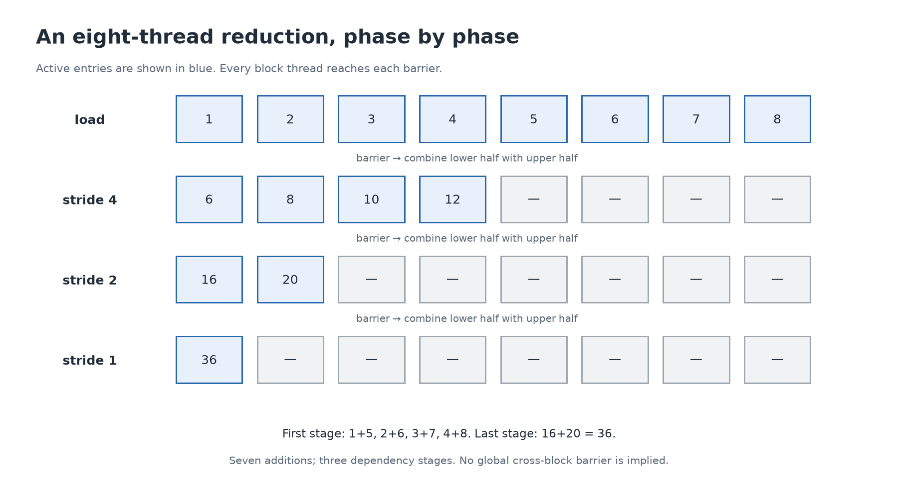

# 9. Many numbers become one: reduction

[← Synchronization](08-synchronization.md) · [Next: matrix multiplication →](10-matmul.md)

**Build today:** sum a block's values using a shared-memory tree. This is E03. It is the first kernel where threads need each other's work.

## Start with eight numbers

The sum of `[1,2,3,4,5,6,7,8]` is 36. A sequential program can add one value at a time. A tree exposes independent additions at each stage:

```text
initial:   [1, 2, 3, 4, 5, 6, 7, 8]
stride 4:  [6, 8, 10, 12]   # 1+5, 2+6, 3+7, 4+8
stride 2:  [16, 20]         # 6+10, 8+12
stride 1:  [36]            # 16+20
```



There are still seven additions, but the dependency chain is three stages. For a power-of-two `B`, a tree has `log2(B)` stages and `B-1` additions. `log2(B)` asks how many times you can halve B to reach one. This is a dependency-depth argument, not a direct wall-clock speedup prediction.

Run the CPU trace:

```sh
make build/cpu/04_reduction
./build/cpu/04_reduction
```

## Publish, combine, wait

The CUDA block uses a shared array, one entry per thread:

```cpp
extern __shared__ float scratch[];
int t = threadIdx.x;
int i = blockIdx.x * blockDim.x + t;
scratch[t] = i < n ? input[i] : 0.0f;
__syncthreads();

for (int stride = blockDim.x / 2; stride > 0; stride /= 2) {
    if (t < stride) scratch[t] += scratch[t + stride];
    __syncthreads();
}
if (t == 0) partial[blockIdx.x] = scratch[0];
```

`extern __shared__` requests a dynamically sized shared-memory region. The host supplies its byte count in the third launch parameter:

```cpp
reduce_sum<<<blocks, threads, threads * sizeof(float)>>>(input, partial, n);
```

This launch must use a one-dimensional power-of-two block size. Shared memory is separate for each block. The first barrier makes the initial values available to the block. Each later barrier separates reduction stages. Only some threads add, but every thread continues to the barrier.

At each stage, active writers update the lower half of the current range using values from its upper half. Those source positions are not being overwritten in that stage. The barrier ensures the next stage sees all completed sums.

## The last block needs identity values

Addition's **identity** is zero: `x + 0 = x`. A tail thread outside the input range writes zero and participates. It must not load past the allocation. That lets the same tree work for a partial final block.

For a maximum reduction the identity is negative infinity, not zero; otherwise an all-negative input could incorrectly produce zero. For a minimum it is positive infinity. The operation and its identity are part of the algorithm.

## A grid still produces several answers

With `n=1003`, `threads=256`, four blocks write four partial sums. `__syncthreads()` cannot combine these across the grid. The supplied lab downloads the partials and finishes in double precision on the CPU. It explicitly teaches a **hybrid reduction**, not a fully GPU-resident global reduction.

A second project can repeatedly launch the same reduction on the partial array until one value remains. Use a second allocation for output; reading and writing overlapping partial arrays within an ordinary launch can introduce cross-block races. Swap input/output roles only after queuing the correct dependency. Do not launch with zero blocks for an empty input; define an empty-sum result on the host.

## Floating-point order matters

Real-number addition is associative: `(a+b)+c = a+(b+c)`. Floating-point arithmetic rounds intermediate results, so that identity can fail numerically. Large values can absorb small ones; subtracting nearly equal large values can expose lost precision.

Our reference computes each block's expected sum in double precision and compares using explicit tolerances. The test adds `0.01f` to avoid exercising only exactly representable quarter increments. It checks every partial, then checks the final total. A tolerance should scale with accumulated error and remain strict enough to reveal missing or duplicated data.

## Your exercise

Implement `reduce_sum` in [the student file](../exercises/kernels.cuh), then run on CUDA hardware:

```sh
make student LAB=04_reduce
compute-sanitizer --error-exitcode 1 --tool racecheck ./build/student/04_reduce
compute-sanitizer --error-exitcode 1 --tool synccheck ./build/student/04_reduce
```

The checker uses 32, 128, and 256 threads and includes sizes just below and above boundaries. Run `memcheck` too; each sanitizer has a different purpose, described in [lesson 11](11-performance.md).

<details>
<summary>Optional review</summary>

Explain the purpose of the first barrier, the barrier after each stage, zero-filled tails, and the separate host/global combination. Why would a block size of 192 fail this particular halving tree even if the GPU permits that block size?

Answer to the last question: the active width eventually becomes three; halving to one drops a contribution. The kernel's algorithmic contract is stricter than the hardware's block-size limit.

</details>
