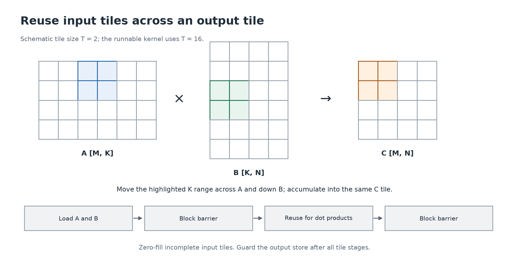

# 10. Matrix multiplication, then shared tiles

[← Reduction](09-reduction.md) · [Next: measurement →](11-performance.md)

**Build today:** two versions of the same matrix product. E04 assigns one output per thread; E05 reuses shared input tiles.

## A matrix is a rectangular table

Let `A` have `M` rows and `K` columns, and `B` have `K` rows and `N` columns. Their product `C` has `M` rows and `N` columns. The repeated size K must match because each output pairs a row of A with a column of B:

```text
C[row,col] = A[row,0]*B[0,col] + ... + A[row,K-1]*B[K-1,col]
shape:       [M,K] × [K,N] -> [M,N]
```

Each such multiply-and-sum is a **dot product**. Matrix multiplication differs from multiplying corresponding elements and keeping every product.

```text
A = [1 2]     B = [2 0 1]     C = [2  6 3]
    [3 4]         [0 3 1]         [6 12 7]

C[1,2] = 3*1 + 4*1 = 7
```

The CPU layout lab verifies this example. The [transformer tensor lesson](../../transformer/guide/02-tensors.md) connects matrix multiplication to learned feature transformations.

## E04: one thread owns one output

Use x for the output column and y for the row. The flat row-major addresses use each matrix's own column count:

```cpp
float sum = 0.0f;
for (int inner = 0; inner < k; ++inner) {
    sum += a[row * k + inner] * b[inner * n + col];
}
c[row * n + col] = sum;
```

Guard `row < m && col < n` before these accesses. The kernel has no shared-memory communication, so out-of-range threads can return. This version is a useful baseline because its ownership and address math are easy to verify.

Fill `matmul_naive`, then run:

```sh
make student LAB=05_matmul ARGS=naive
```

The test includes non-square matrices and sizes such as `[17,19] × [19,23]`. Testing only square matrices can hide swapped dimension strides; testing only multiples of 16 can hide broken edge handling.

## Where repeated work comes from

Neighboring output columns in the same row all need values from that A row. Neighboring output rows in a column all need values from that B column. The naive program expresses repeated global loads of overlapping inputs. Caches may already help, but explicit tiling gives the block control over a reuse pattern.

Choose an output tile of `T × T` entries. For one stage over T inner-dimension values, load:

- A tile covering the output rows and this stage's K range.
- B tile covering this K range and the output columns.

Then use those `2*T*T` values to perform `T*T*T` multiply-accumulates for the output tile.



## E05: trace one tile stage

The reference uses a fixed `16 × 16` block and two shared arrays. Each thread loads one entry of A and one of B:

```cpp
a_tile[ty][tx] = (row < m && base + tx < k)
    ? a[row * k + base + tx] : 0.0f;
b_tile[ty][tx] = (base + ty < k && col < n)
    ? b[(base + ty) * n + col] : 0.0f;
__syncthreads();

for (int inner = 0; inner < 16; ++inner)
    sum += a_tile[ty][inner] * b_tile[inner][tx];
__syncthreads();
```

The `condition ? value_if_true : value_if_false` expression chooses a value. Invalid tile inputs become zeros. `base` starts at zero and increases by 16 along the inner dimension.

The first barrier prevents reading an incompletely loaded tile. The second prevents replacing a tile while another thread still consumes it. Even a thread whose output coordinate lies beyond M or N must participate in the loads and barriers. Only the final global output store is guarded.

For `K=19`, the second stage has only three valid inner positions. Zero-fill the remaining thirteen; the dot product then adds zeros for those positions. Do not read beyond the arrays or skip synchronization because the tile is partial.

## Count arithmetic and bytes

For a full tile stage in float32:

```text
input bytes requested by cooperative loading = 2*T*T*4
arithmetic operations, counting multiply+add as 2 = 2*T*T*T
ratio for this stage = T/4 operations per input byte
```

At T=16, that ratio is 4. This simplified count omits output stores, imperfect edges, cache effects, barriers, and other overhead. It explains the opportunity for reuse; it does not prove the tiled program is faster.

Larger tiles use more shared memory and may affect occupancy. Production implementations also use register tiling, specialized instructions, pipelining, and tuned libraries. Our kernel uses ordinary float arithmetic; it does not explicitly request Tensor Core matrix instructions.

## Validate both algorithms

```sh
make student LAB=05_matmul ARGS=tiled
make student LAB=05_matmul
compute-sanitizer --error-exitcode 1 --tool memcheck ./build/student/05_matmul
compute-sanitizer --error-exitcode 1 --tool racecheck ./build/student/05_matmul
compute-sanitizer --error-exitcode 1 --tool synccheck ./build/student/05_matmul
```

The CPU reference uses double accumulation. Test correctness before adapting the event-timing lab to compare larger shapes. Record full dimensions and identical numerical settings for both versions.

<details>
<summary>Optional review</summary>

Compute C's shape for `[3,7] × [7,5]`. Explain both barriers and why the allocation stride of A uses K while B and C use N. Derive which values thread `(tx=2,ty=3)` loads during `base=16` in output block `(0,0)`.

For that thread, A's candidate is `[3,18]`, B's is `[19,2]`. Each is valid only if its own matrix bounds allow it.

</details>
