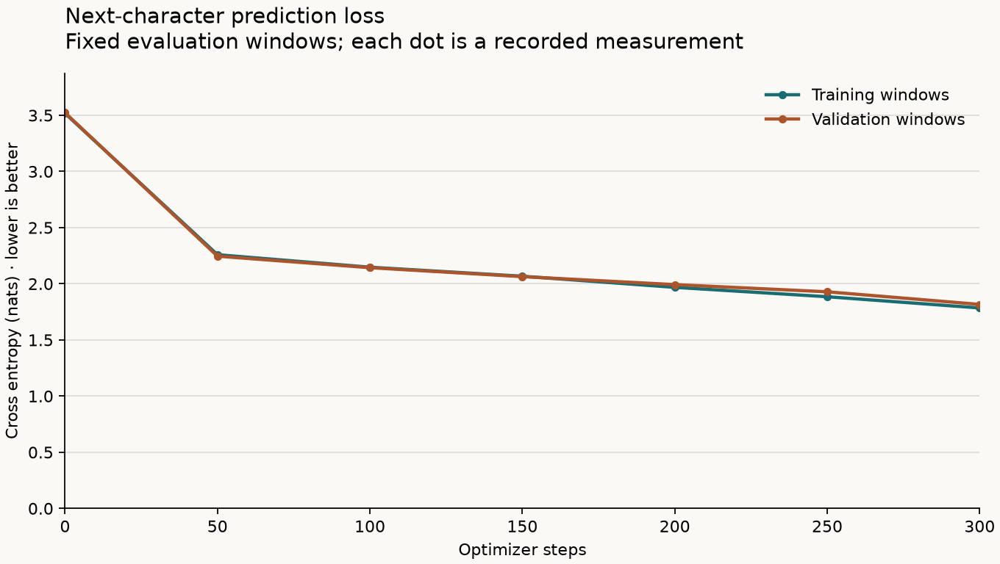
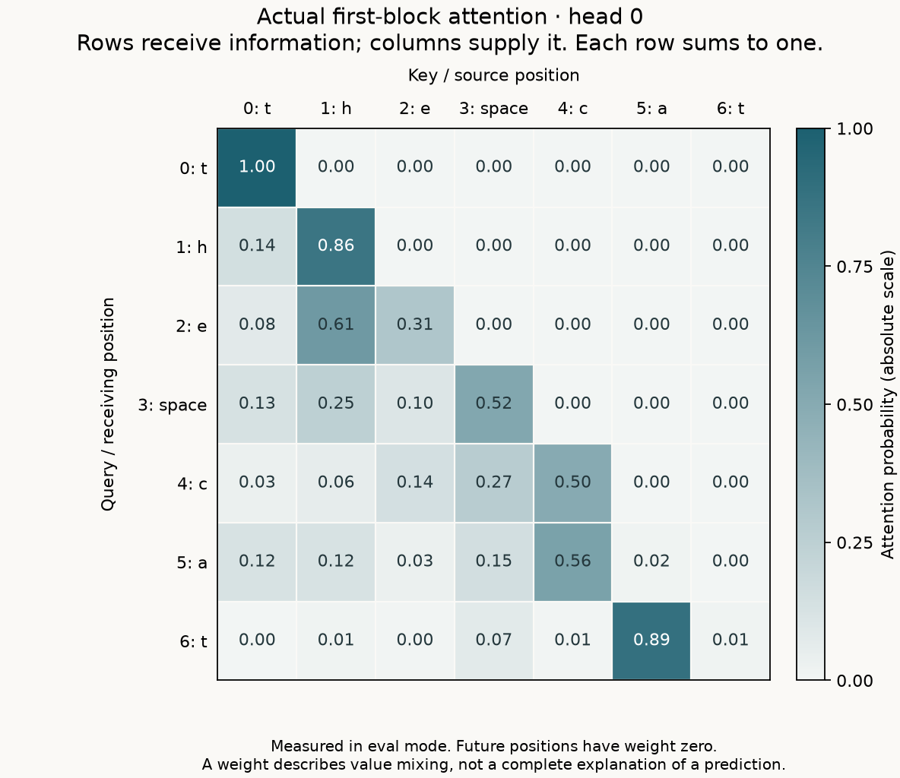

# A real reference run

These files came from the supplied reference implementation on 2026-09-22. The loss measurements and attention weights are computed values, not illustrative placeholders. The student files remain unfinished so you can implement the model and training mechanics yourself.

## What ran

```bash
python -m transformer_lab.train --implementation reference --out-dir artifacts/reference
python -m transformer_lab.generate --checkpoint artifacts/reference/model.pt --prompt 'the ' --new-tokens 120 --temperature 0.8 --seed 1337
python -m transformer_lab.inspect --checkpoint artifacts/reference/model.pt --text 'the cat' --head 0 --output artifacts/reference/attention.png
```

The actual interpreter was `.venv/bin/python`. Environment: Python 3.12.11, PyTorch 2.14.0, Matplotlib 3.11.2, macOS 14.7.4, Apple M3 Pro, arm64. Training used the CPU with one PyTorch thread.

| Setting | Value |
| --- | --- |
| Dataset | `data/tiny_stories.txt`, 40 original teaching paragraphs |
| Characters | 6,851 total; 6,165 training; 686 validation |
| Vocabulary | 30 distinct characters, including whitespace |
| Context length | 32 characters |
| Model width | 48 |
| Attention heads | 4, with 12 features per head |
| Transformer blocks | 2 |
| Feed-forward hidden width | 192 |
| Trainable parameters | 61,086 |
| Dropout | 0 |
| Optimizer | AdamW; learning rate 0.003; weight decay 0.01; betas (0.9, 0.999); epsilon 1e-8 |
| Optimization | 300 updates, 16 windows per batch |
| Main seed | 1337 |
| Evaluation | Step 0, every 50 steps, and the final step; 8 fixed batches per split |

The alphabet is built from the whole file. The text itself is split contiguously 90/10 **before** windows are sampled. Training windows use a separate generator seeded with 1340; training-evaluation windows use 1338; validation windows use 1339. Evaluation runs without dropout or gradients and does not advance the training random-number stream.

Dataset SHA-256: `08c85f652b862081511c2a00f9587721992de18a4e1bc415d6da175e922363de`.

## What improved

| Measurement | Before training | After 300 updates |
| --- | ---: | ---: |
| Training cross entropy | 3.517165 | 1.784939 |
| Validation cross entropy | 3.522857 | 1.816337 |

Both values are mean cross entropy in nats per target character, measured on the same fixed windows each time. The full measurements are in [metrics.csv](metrics.csv).



The complete training command took **16.13 seconds** of wall time on this run, including startup, evaluation, saving, and the first Matplotlib font-cache build. The test suite was running concurrently. This is a record of one run, not a hardware benchmark or a promised runtime.

## What the model generated

With prompt `the `, 120 new characters, temperature 0.8, and generation seed 1337:

```text
the wam andod sloored, ba arin the no sia the thed the stoar waned the coot sher. at he food thes the sook ould fooked hok,
```

The exact output, including whitespace, is in [sample.txt](sample.txt). The model has learned some spelling and spacing patterns; it does not yet write coherent stories. A small loss reduction is not the same thing as language understanding.

## What attention looked like

The image below is **head 0 of the first block**, for the seven input characters `the cat`, measured from the saved model in evaluation mode. Rows are query positions receiving information; columns are key positions supplying information. Future positions have exactly zero probability. Printed values are rounded to two decimals, so printed rows can sum slightly differently from one.



The inspector uses token-plus-position embeddings, then the first block's actual pre-attention layer normalization, then that block's learned query/key/value projections. These weights describe how value vectors are mixed; they are not a complete explanation of a final prediction.

## Verification and limits

All **34 behavioral tests** passed. All six reference model checkpoints (E01–E06) and all four reference training checkpoints (E07–E10) passed. Tests include numerical attention and gradient checks, an independent per-head calculation, causal-prefix invariance, tiny-batch learning, checkpoint loading, generation, PNG export, and evaluation mode/RNG preservation.

This verifies the complete **reference route**. The student route intentionally stops at its TODOs until you implement them. The validation split is small and comes from the same hand-written teaching corpus; it is useful feedback while learning, not a measure of general language ability. Different library versions or hardware can change exact floating-point values and sampled text.

The checkpoint remains at `artifacts/reference/model.pt`. Only the lightweight measurements, sample, and figures were copied here so the guide can show a stable example after you train your own model.
