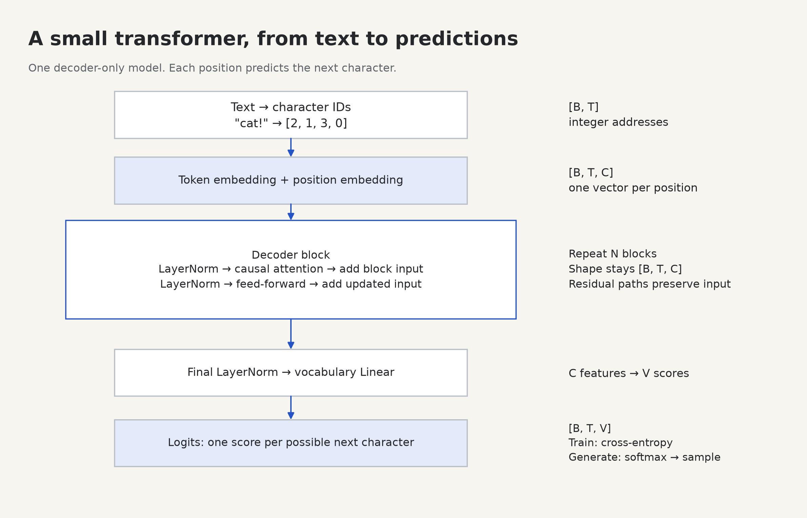

# Start here: from a program to a transformer

You do not need to know machine learning, calculus, or matrix algebra to start. We will introduce the pieces when we use them. You do need to be willing to run a small program, change one thing, and inspect what happened. Work in short sessions; finish the checkpoint before moving on.

## What you are going to make

A small program that reads characters and predicts the next character. Given `the ca`, it might assign a high probability to `t`. After choosing a character, it appends it and predicts again. Repeating that loop produces text.

This is a **character-level language model**. A token is one item in a sequence; here, each character is a token, including spaces and newlines. Larger language models usually use a tokenizer that groups text into longer pieces. Characters keep this first project inspectable.

Our model is a **decoder-only transformer**: it reads the available prefix and predicts what comes next. It has two repeating kinds of work:

1. **Attention mixes information between positions.** A position computes how strongly to use earlier positions and itself, then takes a weighted combination of their information.
2. **A feed-forward network transforms features at each position.** The same small neural network processes each position independently after attention has supplied context.

These operations act on arrays of numbers. There is no built-in dictionary of meaning. Training changes the stored numbers to reduce prediction errors.



The exact normalization and residual wiring appears in [chapter 8](08-block.md). For now, keep the two jobs in mind: **combine context, then transform features**.

## Set up once

A **terminal** accepts commands that run programs. A **Python file** contains instructions for Python. Do not type shell commands into Python's `>>>` prompt. If you see `>>>`, type `exit()` first. In the commands below, copy the command itself, without any `$` prompt symbol.

Open this folder in your editor, open its terminal, and run:

```sh
pwd
python3 --version
```

`pwd` should end in `learning/transformer`. If it does not, on this Mac run:

```sh
cd /Users/djsydney/Downloads/learning/transformer
```

This workspace already has a tested Python 3.12 environment with PyTorch and the plotting library installed. A **virtual environment** is a private directory of Python packages for this project. Activate it and check the installation:

```sh
source .venv/bin/activate
python -c "import torch; print(torch.__version__); print(torch.ones(2, 3))"
```

`torch` is the import name of PyTorch. The last command should print a version and two rows of three ones. A different version string is normal.

<details>
<summary>Installing from a fresh copy, only if .venv does not exist</summary>

Use Python 3.11 or newer with a compatible PyTorch wheel. On a machine with a supported native Python installation:

```sh
python3 -m venv .venv
source .venv/bin/activate
python -m pip install -r requirements.txt
```

`-m` means “run this installed Python module as a program.” `pip` installs libraries. If your Python version has no compatible wheel, use Python 3.12 with `uv`, if installed:

```sh
uv venv --python 3.12 .venv
source .venv/bin/activate
uv pip install -r requirements.txt
```

On this Apple Silicon Mac, the default system `python3` runs as an Intel process. The tested environment uses the installed native interpreter at `/Users/djsydney/.local/bin/python3.12`. To recreate the environment here, choose that interpreter explicitly in the `uv venv --python ...` command. Changing only the Python version may not fix an architecture mismatch.

On Windows, use `py` instead of `python3` to create the environment, then `.venv\Scripts\Activate.ps1` in PowerShell.

</details>

All later `python -m ...` commands work from this project's root. A CPU is enough. The lessons and training commands use CPU by default.

Each new terminal needs `source .venv/bin/activate` again. Activation lasts only in that terminal. You can instead use `.venv/bin/python` wherever the guide says `python`.

## Your first 20 minutes

1. Open [Python foundations](01-python.md) next to [the first lab](../labs/01_python.py).
2. Run `python -m labs.01_python` from this folder.
3. Change one number or word in the lab. Save the file, rerun it, and compare.
4. Make a note: “I expected ___. I saw ___. The reason was ___.”

Do not start by filling every project TODO. The labs teach the smaller skills those TODOs need.

## How to use each lesson

**Predict → run → explain → change → build.** Before running a tensor operation, predict its shape and one element. Afterward, explain the result aloud. Then change one input and predict again. Finally implement the matching project milestone yourself.

The labs are working examples you can experiment with. The project in `transformer_lab/student.py` contains intentionally incomplete operations. A `NotImplementedError` there is an exercise marker. The reference version and hints are available when needed; try the operation on three tokens before looking at the full solution.

| Session | Read | Do | You can move on when… |
|---|---|---|---|
| 1 | [Python](01-python.md) | Lab 01 | You can write and call a function and explain a loop. |
| 2 | [Tensors](02-tensors.md) | Lab 02 | You can predict matrix product shapes. |
| 3 | [Learning](03-learning.md) | Lab 03 | You can explain forward, loss, backward, and step. |
| 4 | [Embeddings](04-embeddings.md) | Lab 04 + E01 | You can distinguish an ID from a learned vector. |
| 5–6 | [Attention](05-attention.md) | Lab 05 + diagram + E02 | You can calculate one output row by hand. |
| 7 | [Multiple heads](06-multihead.md) | E03 | You can track `B,T,C → B,H,T,D → B,T,C`. |
| 8 | [Feed-forward](07-feedforward.md) | Lab 06 + E04 | You can explain what changes across positions. |
| 9 | [Transformer block](08-block.md) | E05 | You can draw both residual paths. |
| 10 | [Training](09-training.md) | E06 | You can explain why the labels are shifted. |
| 11+ | [Final project](10-project.md) | Train, generate, inspect | Your model passes the checks and you can explain a failure. |

Sessions are units of work, not deadlines. Repeat any of them. A good stopping point is a checkpoint you can complete without looking at the solution.

## Read the diagrams alongside the code

The chapters embed PNG diagrams directly in the Markdown. Open your editor's Markdown preview to see the pictures beside their explanations. In VS Code, open a `.md` file and use **Open Preview to the Side** from the command palette. The diagrams are local files; viewing them requires no website or server.

Later, your training run writes an actual loss curve and you can export an attention heatmap from your trained model. The attention lesson's three-token example uses hand-chosen values, clearly distinguished from those measurements. Change its tensors in the lab to perform the experiment yourself.

## When something breaks

Read the last line of the error first. Then find the first line in your own file mentioned above it. `shape` tells you tensor sizes; print it before the failing operation. See [debugging](debugging.md) for common errors.

Next: [Python foundations](01-python.md).
