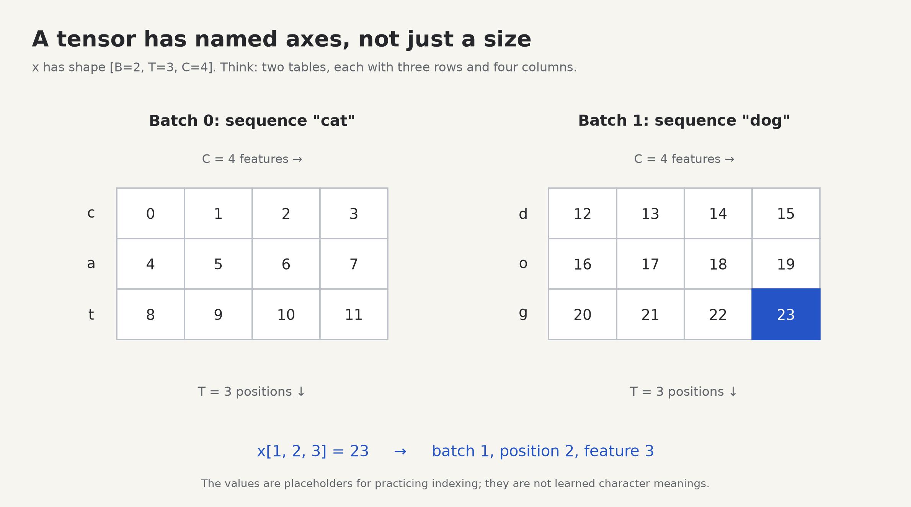

# 2. Tensors: the model's working material

[← Python](01-python.md) · [Next: learning →](03-learning.md)

**Build today:** small arrays that you can multiply and reshape by hand. Your most valuable debugging question will be: **“What does each axis mean?”**

## Start with a table of numbers

A **scalar** is one number. A **vector** is an ordered row of numbers. A **matrix** is a rectangular table of numbers. A **tensor** is the general term we use for these arrays, including arrays with more axes.

```text
scalar                 vector                 matrix
7                      [1, 2, 3]              [[1, 2, 3],
                                               [4, 5, 6]]
shape: ()              shape: (3,)            shape: (2, 3)
zero axes              one axis               two axes
                                              2 rows, 3 columns
```

The **shape** records how many entries there are along each **axis**. A scalar tensor has shape `()`. A one-element vector has shape `(1,)`; these are different shapes even though each stores one number. “Dimension” sometimes means an axis and sometimes means the size of an axis; this guide uses “axis” and “size” when the distinction matters.

```python
import torch

scalar = torch.tensor(7.0)
vector = torch.tensor([1.0, 2.0, 3.0])
matrix = torch.tensor([[1.0, 2.0, 3.0], [4.0, 5.0, 6.0]])

print(scalar.shape)  # torch.Size([])
print(vector.shape)  # torch.Size([3])
print(matrix.shape)  # torch.Size([2, 3])
print(matrix[1, 2])  # tensor(6.)
print(matrix[1])     # tensor([4., 5., 6.])
print(scalar.item()) # 7.0: turn a one-element tensor into a Python number
```

PyTorch stores additional information: `tensor.dtype` describes the number representation, and `tensor.device` says where the array lives, such as CPU or GPU. The [official tensor tutorial](https://docs.pytorch.org/tutorials/beginner/basics/tensorqs_tutorial.html) introduces these properties and tensor creation.

## Our three recurring axes: B, T, C

A transformer handles several sequences at once. In this guide:

| Symbol | Meaning | Example |
| --- | --- | --- |
| `B` | Batch size: number of independent sequences | Two text fragments |
| `T` | Time/sequence length: positions per fragment | Three characters per fragment |
| `C` | Channels/features: numbers describing each position | Four numbers per character |



For an example with `[B=2, T=3, C=4]`, make two sequences of three positions, each with four features. The numbers below are only placeholders for practicing indexing. They do not encode real character properties.

```python
import torch

B, T, C = 2, 3, 4
x = torch.arange(B * T * C, dtype=torch.float32).reshape(B, T, C)
print(x[0, 1])       # tensor([4., 5., 6., 7.]): one token's features
print(x[:, 1, :])    # [2, 4]: position 1 from both sequences
print(x[:, :, 0])    # [2, 3]: feature 0 at every position
print(x.shape[-1])   # 4: the size of the final axis
```

`torch.arange(24)` makes integers from 0 through 23; here `dtype` asks to store them as floats. A `:` in indexing means “all entries on this axis.” A negative axis counts backward: axis `-1` is the final axis, `-2` the second-to-last.

Prediction: what shape is `x[0]`? What shape is `x[0:1]`?

<details>
<summary>Check</summary>

`x[0]` has shape `[3, 4]`: choosing a single batch index removes that axis. `x[0:1]` has shape `[1, 3, 4]`: a slice keeps the axis, with size one. This distinction matters when a function expects an explicit batch axis.

</details>

## Integer IDs versus floating-point features

```python
import torch

ids = torch.tensor([[1, 0, 2]], dtype=torch.long)        # [B=1, T=3]
features = torch.tensor([[[0.2, -0.7], [0.8, 0.1], [0.0, 0.9]]])
print(ids.dtype)       # torch.int64
print(features.dtype) # normally torch.float32
```

IDs identify table rows. Features participate in arithmetic and learning. We explicitly use `torch.long` for token IDs and classification targets; it is PyTorch's signed 64-bit integer type. Model weights and feature vectors in these CPU examples use floating-point numbers. Float values can represent fractions, but most fractions are approximate: compare calculated float tensors with `torch.allclose`, not exact equality.

An ID tensor `[B, T]` will become a feature tensor `[B, T, C]` through embedding lookup in [chapter 4](04-embeddings.md). Nothing about the ID's magnitude tells the model which features it should have.

## Three multiplications that look similar

### 1. Elementwise multiplication: keep every product

```python
import torch

a = torch.tensor([1.0, 2.0, 3.0])
b = torch.tensor([4.0, 5.0, 6.0])
print(a * b)  # tensor([4., 10., 18.])
```

### 2. Dot product: multiply matching entries, then add

```text
a = [1, 2, 3]
b = [4, 5, 6]

a · b = 1×4 + 2×5 + 3×6 = 32
```

```python
print(a @ b)  # tensor(32.)
print((a * b).sum())  # Same calculation for these two vectors.
```

`@` selects dot/matrix multiplication. The result for two vectors is a scalar. A dot product is a weighted sum; it also measures alignment between vectors, with magnitude affecting the score. Attention will compare a query vector with key vectors using dot products.

### 3. Matrix multiplication: many dot products together

```text
A [2, 2]            W [2, 3]                 A @ W [2, 3]
┌      ┐            ┌         ┐              ┌          ┐
│ 1  2 │            │ 2  0  1 │              │ 2   6  3 │
│ 3  4 │            │ 0  3  1 │              │ 6  12  7 │
└      ┘            └         ┘              └          ┘

output[row 0, column 1] = row [1, 2] · column [0, 3] = 6
```

```python
import torch

A = torch.tensor([[1.0, 2.0], [3.0, 4.0]])
W = torch.tensor([[2.0, 0.0, 1.0], [0.0, 3.0, 1.0]])
print(A @ W)
```

The shape rule is `[rows, inner] @ [inner, columns] → [rows, columns]`. The inner sizes must match. `[2, 3] @ [4, 5]` is invalid because 3 is not 4.

For a three-axis tensor, the same weight matrix can operate on the final feature axis at every earlier coordinate:

```text
[B, T, C] @ [C, D] → [B, T, D]
```

`D` is the number of output features. The batch and sequence axes remain in place. You do not need a Python loop over every token. A linear layer will do this for us.

## Broadcasting: reuse values along missing axes

Suppose every position gets the same four-feature bias. We can add a tensor of shape `[C]` to one of shape `[B, T, C]`:

```python
import torch

x = torch.zeros(2, 3, 4)
bias = torch.tensor([10.0, 20.0, 30.0, 40.0])
y = x + bias
print(y.shape)  # [2, 3, 4]
print(y[1, 2]) # tensor([10., 20., 30., 40.])
```

To check broadcasting, align shapes from the **right**. Each pair of sizes must be equal, or one size must be 1. Missing leading axes act like size 1:

```text
x:            [2, 3, 4]
bias:               [4]
as aligned:   [1, 1, 4]   → reusable across batches and positions

positions:       [3, 4]
as aligned:   [1, 3, 4]   → reusable across batches
```

Adding `[T]` directly to `[B, T, C]` does **not** mean “add one number per position”: it aligns `T` against `C`. To add a per-position scalar, shape it as `[T, 1]`. The final `1` allows reuse across features.

## Reshape changes grouping; transpose swaps axes

`reshape` preserves the number of elements and reinterprets their grouping. `transpose` swaps two axes while preserving which coordinates belong together.

```python
import torch

x = torch.tensor([[0, 1, 2], [3, 4, 5]])  # [2, 3]
print(x.reshape(3, 2))
# [[0, 1], [2, 3], [4, 5]]

print(x.transpose(0, 1))
# [[0, 3], [1, 4], [2, 5]]
```

Both results have shape `[3, 2]`, but their values are arranged differently. Shape alone cannot prove correctness.

`x.reshape(-1)` flattens the values into one axis; `-1` asks PyTorch to infer that size. You can infer only one axis in a reshape. `x.unsqueeze(0)` adds a size-one axis at the front; a vector `[T]` becomes `[1, T]`. Transpose can produce a noncontiguous view in memory; `reshape` may make a copy when needed. We use `reshape` instead of relying on `view` where memory layout may have changed.

Attention will use `k.transpose(-2, -1)` to put key features in the inner multiplication dimension. Multihead attention will require both reshaping **and** transposing. Replacing one with the other creates a subtle bug.

## Reductions collapse selected axes

```python
import torch

x = torch.tensor([[1.0, 3.0], [5.0, 7.0]])
print(x.mean())       # tensor(4.): mean of all four values
print(x.mean(dim=0))  # tensor([3., 5.]): combine rows
print(x.mean(dim=1))  # tensor([2., 6.]): combine columns within each row
print(x.mean(dim=1, keepdim=True).shape)  # [2, 1]
```

`dim` selects the axis to reduce. `keepdim=True` leaves that axis at size 1, which can make a later broadcast easier to understand.

## Small tools for inspecting an experiment

You will see these methods in the labs:

| Expression | Purpose |
| --- | --- |
| `x.tolist()` | Convert tensor values into ordinary Python lists for printing or decoding |
| `x.clone()` | Make a separate copy of the tensor values so an experiment can change the copy |
| `x.abs()` | Replace each value with its absolute value: `-3` becomes `3` |
| `x.numel()` | Count the stored elements; `[2, 3, 4]` contains 24 |
| `torch.equal(a, b)` | Check that two tensors have the same shape and exactly equal elements |
| `torch.allclose(a, b)` | Check numerical agreement with a small tolerance |

A trailing underscore usually marks a method that changes the tensor in place: `x.zero_()` fills `x` with zeros, and `x.copy_(y)` copies values from `y` into `x`. You will see these only for controlled setup in the early labs. Ordinary calculations such as `y = x + 1` produce a result without replacing `x`'s values. The next chapter explains why we put manual parameter changes inside `torch.no_grad()`.

## Do the lab

Read [labs/02_tensors.py](../labs/02_tensors.py), then run:

```bash
python -m labs.02_tensors
```

Check the dot product is `32`, the matrix product is `[[2, 6, 3], [6, 12, 7]]`, and the “same shape means same values?” line says `False`.

1. Change `B, T, C` to `2, 4, 6`. Predict the shape after `transpose(1, 2)`.
2. Given `x.shape == [2, 4, 6]` and `W.shape == [6, 10]`, predict `(x @ W).shape`.
3. Create a `[4, 1]` tensor whose rows are `0, 1, 2, 3`, and add it to zeros of shape `[2, 4, 6]`. Print batch 1, position 2.
4. Explain why `torch.arange(12).reshape(2, 5)` fails.

<details>
<summary>Solutions</summary>

1. `[2, 6, 4]`.
2. `[2, 4, 10]`.
3. `positions = torch.arange(4).reshape(4, 1)`; `y = torch.zeros(2, 4, 6) + positions`. `y[1, 2]` is six copies of `2.0`.
4. There are 12 elements, but the requested shape has room for only `2 × 5 = 10`.

</details>

## Before you continue

You are ready when you can draw `[B, T, C]`, index one token's feature vector, calculate a small dot product, predict a matrix product's shape, and show with numbers why transpose is different from reshape. Keep a paper shape ledger beside you from here onward.

[Next: how adjustable numbers learn →](03-learning.md)
