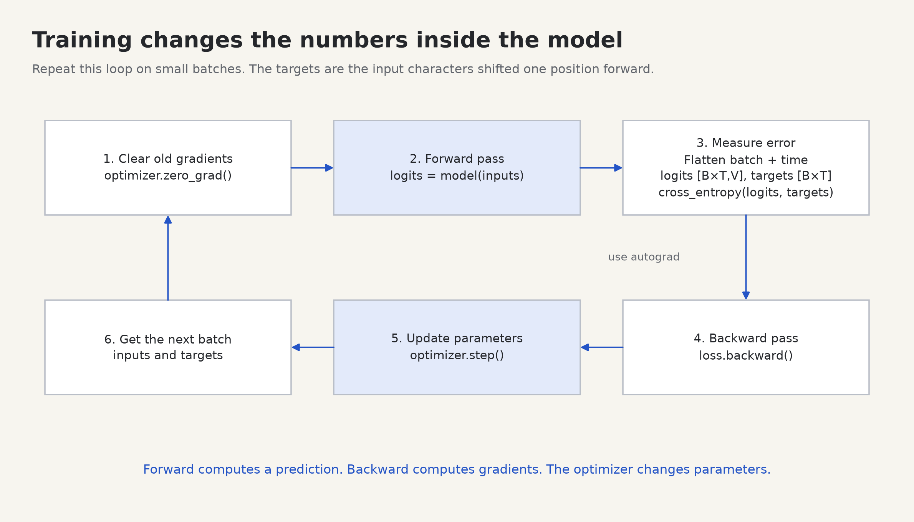

# 3. How a program learns its numbers

[← Tensors](02-tensors.md) · [Next: embeddings →](04-embeddings.md)

**Build today:** a model that discovers the rule `y = 2x + 1` from examples. A transformer has many more adjustable numbers, but its learning loop follows the same sequence.

## A model is a calculation with adjustable parameters

Suppose the correct outputs are:

| Input x | Correct output y |
| --- | --- |
| -2 | -3 |
| -1 | -1 |
| 0 | 1 |
| 1 | 3 |
| 2 | 5 |

We know the rule here so we can check the result. Give the model the form `prediction = weight * x + bias`, but start `weight` and `bias` at zero. Training must find useful values.

```text
                 weight w
                    │
input x ── multiply by w ── add bias b ── prediction

initially: x=2 ── ×0 ── +0 ── 0       correct answer: 5
after learning: ── ×2 ── +1 ── 5
```

A **parameter** is an adjustable number stored in the model. A **hyperparameter** is a choice you make about training or architecture, such as learning rate, layer width, or number of steps. The optimizer updates parameters; it does not discover your chosen learning rate in this project.

## Linear layers: learned weighted sums

For two input features and one output, a linear layer calculates:

```text
output = input[0] × weight[0] + input[1] × weight[1] + bias

input = [2, 3], weight = [4, -1], bias = 0.5
output = 2×4 + 3×(-1) + 0.5 = 5.5
```

PyTorch calls this `nn.Linear`, although including a bias makes it an affine transformation in mathematical terminology. Its weight tensor has shape `[out_features, in_features]`, and the calculation is `x @ weight.T + bias`. Earlier axes are preserved; `nn.Linear(C, D)` maps `[B, T, C]` to `[B, T, D]`. See the [Linear API](https://docs.pytorch.org/docs/stable/generated/torch.nn.Linear.html).

Run this complete example:

```python
import torch
from torch import nn

layer = nn.Linear(2, 1)
with torch.no_grad():
    layer.weight.copy_(torch.tensor([[4.0, -1.0]]))
    layer.bias.copy_(torch.tensor([0.5]))

x = torch.tensor([[2.0, 3.0]])  # One example, two input features.
print(layer(x))                 # tensor([[5.5000]], ...)
print(layer.weight.shape)      # [1, 2]
```

The `with torch.no_grad():` block lets us set demonstration weights without recording these setup operations for differentiation. Normally PyTorch initializes the layer and training updates its values.

## Why an activation goes between linear layers

One weighted sum can express only a limited family of relationships. Stacking two affine calculations without a nonlinear operation still produces an affine calculation:

```text
first:  z = a×x + b
second: y = c×z + d
combined: y = (c×a)×x + (c×b + d)
```

The result has the same form as one layer. An **activation function** bends the calculation so a stack can represent more complicated relationships.

For **ReLU**, keep positive inputs and replace negative inputs with zero:

```text
input:   -3  -2  -1   0   1   2   3
output:   0   0   0   0   1   2   3

output
  3 │            /
  2 │          /
  1 │        /
  0 ├───────/──────── input
          0
```

```python
import torch
from torch import nn

print(torch.relu(torch.tensor([-2.0, 0.0, 2.0])))  # [0, 0, 2]
network = nn.Sequential(nn.Linear(2, 8), nn.ReLU(), nn.Linear(8, 2))
print(network(torch.zeros(1, 3, 2)).shape)  # [1, 3, 2]
```

`nn.Sequential` runs the listed modules in order. The hidden width here is eight. Feed-forward blocks use this expand → activation → project pattern. The project uses a smooth activation called **GELU**; ReLU makes the first hand calculation easier. Neither activation mixes information between different token positions by itself.

## Loss measures how wrong the prediction is

For a numerical target, one simple loss is the squared error:

```text
prediction = 4, correct answer = 6
error = 4 - 6 = -2
squared error = (-2)² = 4
```

Squaring makes either direction of error cost something. For multiple examples, average their squared errors: **mean squared error**, or MSE. `((predictions - targets) ** 2).mean()` implements it.

The loss must be connected to the parameters through the calculations that produced the prediction. If you turn intermediate tensors into Python numbers with `.item()` and calculate the training loss from those numbers, that connection is lost. Use `.item()` for reporting, after you have kept the tensor loss for learning.

## A gradient says how a tiny parameter change affects loss

Imagine standing on a curve where horizontal position is a weight and height is the loss. The **derivative** is the local slope: how quickly height changes as you move right. A positive slope means moving the weight slightly upward increases the loss; a negative slope means it decreases the loss. With many parameters, the collection of these slopes is the **gradient**.

```text
loss
high │ \                   /
     │  \                 /
     │   \               /
low  │    \_____________/
     └────────────────────── weight
           → toward lower loss
```

For one example, let `prediction = 2w`, target `6`, and loss `(2w - 6)²`. At `w = 0`, the loss is `36`. The derivative is `4(2w - 6)`, so at zero the gradient is `-24`. You do not need calculus fluency to run the project; this example lets you check PyTorch's result.

```python
import torch

w = torch.tensor(0.0, requires_grad=True)
prediction = 2 * w
loss = (prediction - 6) ** 2
loss.backward()

print(loss.item())    # 36.0
print(w.grad.item())  # -24.0

with torch.no_grad():
    w -= 0.1 * w.grad
print(w.item())       # approximately 2.4
```

`requires_grad=True` requests gradient tracking for this floating-point tensor. **Autograd** records the forward calculation; `backward()` applies the chain rule through that recorded calculation to populate gradients. It computes derivatives of the actual operations, rather than estimating them by repeatedly nudging weights. See [PyTorch's autograd introduction](https://docs.pytorch.org/tutorials/beginner/basics/autogradqs_tutorial.html).

The update is:

```text
new_weight = old_weight - learning_rate × gradient
           = 0          - 0.1 × (-24)
           = 2.4
```

Now the prediction is `4.8`, and the loss is `1.44`: an improvement from `36`. The **learning rate** sets the step size. A gradient describes a local slope, so a very large step can overshoot and increase the loss. Training is not guaranteed to improve on every update.

Prediction: if the gradient were `+24` instead, which direction would the weight move?

<details>
<summary>Check</summary>

Downward, because the update subtracts a positive number. Gradient descent moves opposite the gradient.

</details>

## The complete training loop



Here is a complete small program. You can paste it into `scratch.py`; the corresponding lab adds diagnostics and checks.

```python
import torch
from torch import nn

class Line(nn.Module):
    def __init__(self):
        super().__init__()
        self.linear = nn.Linear(1, 1)

    def forward(self, x):
        return self.linear(x)

x = torch.tensor([[-2.0], [-1.0], [0.0], [1.0], [2.0]])
targets = 2 * x + 1
model = Line()
with torch.no_grad():
    model.linear.weight.zero_()
    model.linear.bias.zero_()

optimizer = torch.optim.SGD(model.parameters(), lr=0.1)

model.train()
for step in range(80):
    optimizer.zero_grad(set_to_none=True)
    predictions = model(x)
    loss = ((predictions - targets) ** 2).mean()
    loss.backward()
    optimizer.step()

model.eval()
with torch.no_grad():
    print(model(torch.tensor([[3.0]])).item())  # approximately 7
```

Read the five loop operations as a repeated procedure:

1. **`zero_grad`** clears gradients left by previous steps. PyTorch accumulates gradients; it does not automatically replace them on every backward call. `set_to_none=True` clears them by marking them absent until the next backward pass.
2. **`model(x)`** performs the forward calculation using current parameters.
3. **Loss calculation** compares the predictions with the correct targets.
4. **`loss.backward()`** computes gradients. This does not update the parameter values.
5. **`optimizer.step()`** updates those parameter values using the gradients.

`model.parameters()` supplies the model's registered parameters to the optimizer. This example uses SGD with its default zero momentum, so each update subtracts the learning rate times the gradient. Larger models often use AdamW; it changes the update rule, while the forward/loss/backward sequence remains. See [PyTorch's optimization tutorial](https://docs.pytorch.org/tutorials/beginner/basics/optimization_tutorial.html).

An **iteration** or **step** here means one optimizer update. A **batch** is the group of examples used in that update. An **epoch** means a pass through a defined training dataset. This toy loop reuses all five examples on every step; the later language-model trainer samples text windows, so it reports steps rather than claiming that each step is an epoch.

## Training mode and gradient recording are separate controls

| Control | What it does |
| --- | --- |
| `model.train()` | Selects training behavior for mode-dependent layers such as dropout |
| `model.eval()` | Selects evaluation behavior for those layers |
| `with torch.no_grad():` | Disables recording the enclosed operations for reverse-mode gradients |

Calling `eval()` alone does not disable gradient tracking, and calling `train()` does not take a training step. Our simple linear model has no layer whose computation changes between those modes, but the distinction matters as your models grow.

The `with ...:` syntax applies a temporary behavior to its indented block and restores the previous behavior afterward. In later lab prints, `x.detach()` gives a tensor disconnected from the gradient history. It is useful for displaying or exporting values, but detaching inside the computation that should learn would cut the gradient path. `detach()` is also not a separate storage copy; use `clone()` when you need independently editable values.

## Predicting a character needs a different loss

A character model predicts one of `V` vocabulary entries, not a single number on a scale. It produces `V` **logits**: unrestricted scores, one per possible next token. A larger logit means greater preference relative to the others.

**Softmax** converts logits to positive probabilities that sum to one. For scores `[0, 0, 0, 0]`, the probabilities are `[0.25, 0.25, 0.25, 0.25]`. For training, **cross entropy** scores how much probability the model assigns to the correct class. For one target, its value is `-log(probability_of_correct_token)` using the natural logarithm. Smaller is better.

You can understand that loss before learning logarithm rules: assigning the correct token probability `1` gives loss `0`; probability `0.5` gives about `0.693`; probability `0.25` gives about `1.386`. Lower confidence in the correct answer receives a larger penalty. Softmax uses the exponential `exp(score)`, meaning `e` raised to that score, where `e` is about `2.718`. Exponentials are positive; dividing them by their sum creates probabilities. [Attention](05-attention.md) works through that normalization one row at a time.

```python
import torch
from torch.nn import functional as F

logits = torch.tensor([[0.0, 0.0, 0.0, 0.0]], requires_grad=True)
target = torch.tensor([2], dtype=torch.long)
print(torch.softmax(logits, dim=-1))  # Four probabilities of 0.25.
loss = F.cross_entropy(logits, target)
print(loss.item())                   # approximately 1.3863 = -log(0.25)
loss.backward()
print(logits.grad)                   # approximately [0.25, 0.25, -0.75, 0.25]
```

Pass **raw logits** to `F.cross_entropy`; the function handles the required log-softmax computation. Do not apply softmax first. In this simple example, descending along the gradient raises the correct class's logit and lowers the other logits. Later, that signal flows backward into the model's parameters.

## Do the lab

Read [labs/03_learning.py](../labs/03_learning.py) and run:

```bash
python -m labs.03_learning
```

With the default settings, the first regression loss is `9.000000`, the learned weight and bias print as `2.0000` and `1.0000`, and the prediction for `x=3` prints as `7.0000`.

1. Before running, calculate the first regression gradients at `weight=0`, `bias=0`. Use the symmetric inputs to simplify the mean.
2. Lower `LEARNING_RATE` from `0.1` to `0.01`. Keep 80 steps. Why might the final accuracy assertion fail?
3. Set it to `0.6`. Watch the loss instead of assuming a larger step learns faster. Restore defaults afterward.
4. Comment out `optimizer.step()`. Predict the loss and parameters before rerunning.
5. Explain why initializing this tiny one-layer regression model to zero is fine here, but does not establish a good initialization rule for deep networks.

<details>
<summary>Solutions</summary>

1. The weight gradient is `mean(2 * (0 - targets) * x) = -8`; the bias gradient is `mean(2 * (0 - targets)) = -2`. After the first step, `weight=0.8`, `bias=0.2`.
2. The steps are smaller; 80 updates may be insufficient to meet the deliberately strict final tolerance. Increase the step count or restore defaults.
3. For this dataset the slope update has error multiplier `1 - 4×learning_rate`. At `0.6` this is `-1.4`, so its error alternates signs and grows. A larger rate can diverge.
4. The parameters stay at zero and loss remains 9; gradients alone do not change parameters. The final assertion fails as expected.
5. This model has only one output unit. In a multilayer network, identical zero-initialized units can remain symmetric and fail to learn distinct features. We manually choose zeros here only to make the arithmetic transparent; the transformer uses appropriate layer initialization.

</details>

## Before you continue

You are ready when you can explain the difference between a parameter, prediction, loss, gradient, and learning rate; identify which line computes gradients versus updates weights; and trace one numerical update by hand. You should also be able to say why a nonlinear activation belongs between linear layers.

[Next: turning text into feature vectors →](04-embeddings.md)
