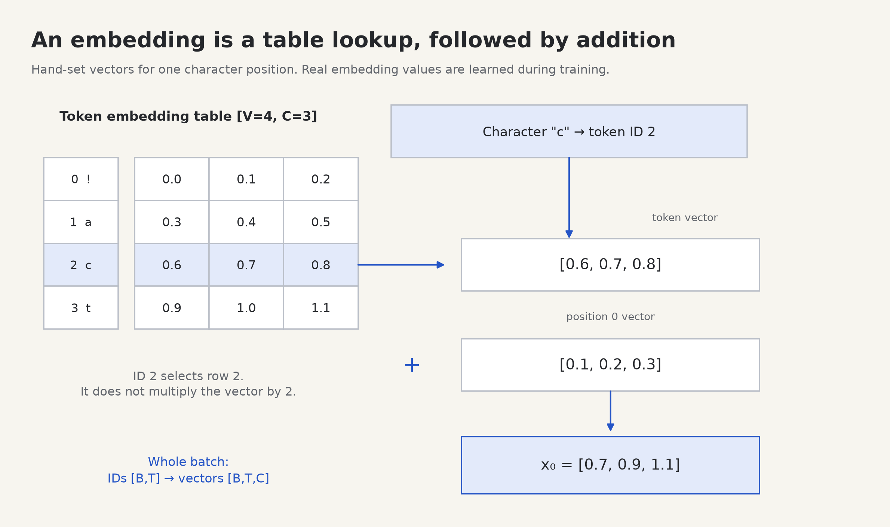

# 4. From text to vectors

[← Learning](03-learning.md) · [Next: attention →](05-attention.md)

**Build today:** convert a short text fragment into the `[B, T, C]` tensor that enters a transformer, then construct the next-token answers used for training.

## Tokens are the units the model receives

A model operates on numbers. A **tokenizer** converts text into discrete symbols and assigns each symbol an integer ID. Our project uses **character tokens** so you can see every step: `"cat!"` is four tokens. Larger language models commonly use tokenizers whose pieces can contain whole words or parts of words; character tokenization keeps this first project small and inspectable.

A **vocabulary** is the set of allowed tokens. Build it consistently:

```python
text = "cat!cat!"
characters = sorted(set(text))
char_to_id = {character: index for index, character in enumerate(characters)}

def encode(text):
    return [char_to_id[character] for character in text]

def decode(ids):
    return "".join(characters[token_id] for token_id in ids)

print(characters)          # ['!', 'a', 'c', 't']
print(encode("cat!"))      # [2, 1, 3, 0]
print(decode([2, 1, 3, 0])) # cat!
```

The sorting ensures IDs are stable when rebuilding from the same character set. If you change the mapping after training, an old ID may point to a different character, so save the vocabulary with the model. Whitespace also counts as characters when present in the corpus: a space and a newline are different tokens.

```text
text           tokenization          IDs
"cat!"    →    "c" "a" "t" "!"   →   [2, 1, 3, 0]

                                           │ table lookup
                                           ▼
                                  one vector per position
```

Do not treat `[2, 1, 3, 0]` as four numerical measurements. Multiplying the ID `3` by a scalar is not how the model should understand `"t"`. Each ID is an address used to retrieve a trainable feature vector.

## An embedding is a learned table

Let `V` be vocabulary size and `C` the number of features per token. The token embedding table has shape `[V, C]`. Row `i` contains the vector for token ID `i`.



```text
V = 4, C = 3             embedding table [4, 3]

ID  character           feature 0   feature 1   feature 2
0      !                   0.0         0.1         0.2
1      a                   0.3         0.4         0.5
2      c                   0.6         0.7         0.8  ◀── ID 2 selects this row
3      t                   0.9         1.0         1.1
```

Those numbers are hand-chosen for the diagram. Real learned embeddings start from an initialization and are adjusted through the training loss. We do not label feature 0 “animal” and feature 1 “punctuation.” Features acquire whatever distributed representation the training process finds useful; individual coordinates need not have simple human names.

`nn.Embedding(V, C)` stores this trainable table. Given integer IDs of shape `[B, T]`, it returns the corresponding rows with shape `[B, T, C]`. The ID values are discrete lookup indices; gradients update selected table rows, rather than changing the ID tensor into fractional IDs. See the [Embedding API](https://docs.pytorch.org/docs/stable/generated/torch.nn.Embedding.html).

```python
import torch
from torch import nn

table = nn.Embedding(4, 3)
with torch.no_grad():
    table.weight.copy_(torch.arange(12).reshape(4, 3) / 10)

ids = torch.tensor([[2, 1, 3, 0]], dtype=torch.long)
vectors = table(ids)
print(vectors.shape)  # [1, 4, 3]
print(vectors[0, 0])  # tensor([0.6, 0.7, 0.8], ...)
```

This is a lookup, not multiplication by the ID's magnitude. `table.weight[2]` and `vectors[0, 0]` contain the same values in this example. The table has `V × C = 12` trainable numbers.

Prediction: if the input is `[[2, 2]]`, will its two token embedding vectors differ?

<details>
<summary>Check</summary>

No. Both IDs select row 2 from the same table. Later computation can create different contextual representations, but raw token lookup alone gives the same vector for repeated IDs.

</details>

## Why we also supply position

Token lookup tells us which character is present. It does not explicitly tell us whether that character is first, second, or third. Word and character order affects meaning, so our model also learns a table indexed by position.

For a maximum context length `max_T`, the position table has shape `[max_T, C]`. At position `t`, add its position vector to the token vector:

```text
token IDs          [2,     1,     3,     0]       shape [B=1, T=4]
                   │      │      │      │
token vectors      c      a      t      !         shape [1, 4, C]
                   +      +      +      +
position vectors   p0     p1     p2     p3        shape [4, C]
                   │      │      │      │
model input        x0     x1     x2     x3        shape [1, 4, C]
```

The position vectors are shared across the batch. Addition broadcasts `[T, C]` across `[B, T, C]`. Adding keeps the feature width at `C`; concatenating would instead increase it.

Run this complete example:

```python
import torch
from torch import nn

B, T, C = 1, 4, 3
V = 4
max_T = 8
token_table = nn.Embedding(V, C)
position_table = nn.Embedding(max_T, C)

ids = torch.tensor([[2, 1, 3, 0]], dtype=torch.long)
positions = torch.arange(T, dtype=torch.long)
token_vectors = token_table(ids)             # [1, 4, 3]
position_vectors = position_table(positions) # [4, 3]
x = token_vectors + position_vectors        # [1, 4, 3]

print(ids.shape, positions.shape, x.shape)
```

These two tables are learned parameters. The position input `[0, 1, 2, 3]` is fixed indexing; the vectors retrieved by those indices are adjustable. We use learned absolute positions to keep the implementation direct. Other models encode position differently; this project does not require mastering all of those methods first.

The maximum table length is a real limit: index `max_T` is outside a table with `max_T` rows. Training and generation must keep each model call within its supported context length. A sliding window can let generation continue using only recent tokens; it does not make the model remember tokens outside that window.

## What exactly are we training it to predict?

At every position, predict the **next** character using only the characters available up to that position. The “correct answer” is already in the text, one position later. We do not need a person to label every example.

```text
text stream:        c   a   t   !   c   a   t   !
stream indices:     0   1   2   3   4   5   6   7

one input window:   c   a   t   !
matching targets:   a   t   !   c
                    ↑   ↑   ↑   ↑
prediction task:    next character at each input position
```

At the four positions, the tasks are:

| Position | Allowed input context | Correct next token |
| --- | --- | --- |
| 0 | `c` | `a` |
| 1 | `ca` | `t` |
| 2 | `cat` | `!` |
| 3 | `cat!` | `c` |

Four input tokens require **five consecutive source tokens** to construct four next-token targets. “Target” means correct output, not a separate input feature.

```python
import torch

# IDs for "cat!cat!" under {'!': 0, 'a': 1, 'c': 2, 't': 3}.
stream = torch.tensor([2, 1, 3, 0, 2, 1, 3, 0], dtype=torch.long)
T = 4
start = 0
inputs = stream[start : start + T]
targets = stream[start + 1 : start + T + 1]

print(inputs.tolist())  # [2, 1, 3, 0]
print(targets.tolist()) # [1, 3, 0, 2]

inputs = inputs.unsqueeze(0)    # Add batch axis: [1, 4].
targets = targets.unsqueeze(0)  # Add batch axis: [1, 4].
assert torch.equal(inputs[:, 1:], targets[:, :-1])
```

The model will output logits of shape `[B, T, V]`, one score for each candidate token at each position. Targets remain integer IDs of shape `[B, T]`. You will flatten the first two axes when computing the language-model cross entropy, as explained in [training](09-training.md).

## The future is present in the batch, so we must block it

All four input positions are computed together for efficient training. But at position 0, the model must not inspect input position 1: that position already contains its answer `a`.

```text
receiver / allowed source   0:c   1:a   2:t   3:!
position 0                  yes   no    no    no
position 1                  yes   yes   no    no
position 2                  yes   yes   yes   no
position 3                  yes   yes   yes   yes
```

The next chapter implements this rule using **causal attention**. “Causal” here means a position can use itself and earlier positions, but cannot read later positions. Shifting targets is necessary; shifting them alone does not prevent leakage through an unmasked attention calculation.

Notice that each batch sequence has its own context. Batch 1 is not the continuation of batch 0. The attention computation must preserve that separation.

## Do the lab

Open [labs/04_embeddings.py](../labs/04_embeddings.py) and run:

```bash
python -m labs.04_embeddings
```

The default IDs are `[[2, 1, 3, 0]]`. The first token vector is `[0.6, 0.7, 0.8]`. The input and target strings print as `cat!` and `at!c`. This lab uses tiny hand-filled tables so you can calculate the output; the full project trains the tables.

1. Change `MESSAGE` to `"tact"`. Which two raw token vectors must match? Should their combined token-plus-position vectors match?
2. Set all position table weights to zero. What distinction has this input representation lost?
3. For `V=20`, `C=16`, and `max_T=32`, calculate the total parameter count of both embedding tables.
4. Using the stream above, start a four-token window at index 2. Decode the inputs and targets.
5. Explain why a target tensor should contain IDs instead of the corresponding embedding vectors.

<details>
<summary>Solutions</summary>

1. Positions 0 and 3 both contain `t`, so their token lookup vectors match. Their position vectors differ, so the combined vectors differ in the hand-filled lab.
2. Equal tokens at different positions now have identical input vectors. You have removed the explicit position signal from the embeddings. The causal mask still imposes a directional structure on later attention; this experiment does not prove that every whole-model output becomes invariant to order.
3. `20 × 16 + 32 × 16 = 832` trainable parameters.
4. Inputs: `t!ca`; targets: `!cat`.
5. Cross entropy needs the correct vocabulary class at each position. The embedding vectors are learned model parameters and are not the class labels being predicted.

</details>

## Before you continue

You are ready when you can construct a tokenizer, trace one ID into one table row, explain `[B, T] → [B, T, C]`, add position vectors with the correct shapes, and make shifted targets by hand. You should be able to point to exactly which input position would leak an answer if attention could read the future.

[Next: attention, one weighted average at a time →](05-attention.md)
