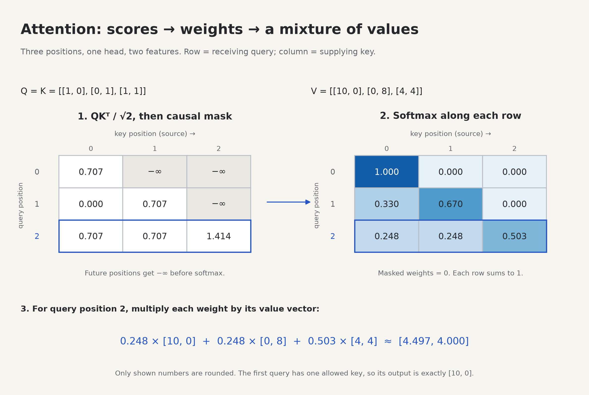

# 5. Attention: a weighted mixture of other positions

Before this lesson: [embeddings](04-embeddings.md). Run `python -m labs.05_attention`. You will implement **E02** in `transformer_lab/student.py` after working the small example below.



The diagram and lab use the same Q, K, and V values. Read the diagram from left to right, then follow one row through the code.

## Start with an ordinary weighted average

Suppose three positions carry these **value vectors**:

```text
position 0: [10, 0]
position 1: [ 0, 8]
position 2: [ 4, 4]
```

A vector is just an ordered list of numbers. If a position chooses weights `[0.50, 0.25, 0.25]`, its new vector is:

```text
0.50 × [10, 0] + 0.25 × [0, 8] + 0.25 × [4, 4]
=       [5, 0] +        [0, 2] +        [1, 1]
= [6, 3]
```

The weights are nonnegative and sum to one. Each output coordinate is a weighted average of that coordinate in the input values. Attention learns how to produce useful weights **from the current input**, rather than storing a fixed weight for “always use the previous character.”

## Queries, keys, and values are three computed views

Every position begins with a feature vector `x`. Three learned linear layers create:

| Name | Role | Analogy, with limits |
|---|---|---|
| Query, `q` | Compare this position with every available key. | What information would help this position? |
| Key, `k` | Be compared with each query. | How can this position be matched? |
| Value, `v` | Supply the numbers mixed into the output. | What information does this position contribute? |

The questions are a memory aid. The machine does not ask literal questions. Queries, keys, and values are learned numeric projections; individual coordinates do not have assigned English meanings.

```text
                     ┌─ Linear for Q ─ queries ─┐
position vectors X ──┼─ Linear for K ─ keys ────┴─ compare → weights ─┐
                     └─ Linear for V ─ values ──────────────────────┴→ mixture
```

Using separate projections lets a position be useful to another position for reasons different from the content it supplies. In **self-attention**, Q, K, and V come from the same input sequence. In cross-attention, queries come from one sequence and keys/values from another; that is an extension, not required for this decoder-only project.

## Step 1: compare one query with every key

A **dot product** multiplies matching coordinates and adds them. For example:

```text
[1, 2] · [3, 4] = 1×3 + 2×4 = 11
```

It is a learned compatibility score here. It is not a distance, a probability, or necessarily semantic similarity. Larger vector magnitudes can also produce larger dot products.

Use a tiny head with two features, `D = 2`. For this arithmetic example, imagine that the learned projections have already produced:

```python
import math
import torch

q = torch.tensor([[1., 0.], [0., 1.], [1., 1.]])  # [T=3, D=2]
k = torch.tensor([[1., 0.], [0., 1.], [1., 1.]])
v = torch.tensor([[10., 0.], [0., 8.], [4., 4.]])
scores = q @ k.transpose(-2, -1) / math.sqrt(2)
print(scores)
```

`@` is matrix multiplication. `k.transpose(-2, -1)` exchanges the last two axes: `[3,2] → [2,3]`. Each row of Q now meets every column of K-transpose. The result has shape `[3,3]`.

```text
                         key position (information source)
                         0        1        2
query position 0       0.707    0.000    0.707
(receiver)     1       0.000    0.707    0.707
               2       0.707    0.707    1.414
```

The division by `sqrt(D)` keeps score scale more manageable as the number of features increases. Under a simple independent, unit-variance coordinate assumption, the unscaled dot product's variance grows with D. Very large scores can make softmax extremely concentrated. This scaling addresses that effect; it does not guarantee a particular distribution for learned vectors.

## Step 2: prevent looking at the answer

At position 0, the model is predicting position 1. If it could look at position 1's input, it would see the answer during training. A **causal mask** permits only the current and earlier positions:

```text
            key 0  key 1  key 2
query 0      yes     no     no
query 1      yes    yes     no
query 2      yes    yes    yes
```

Set forbidden **scores** to negative infinity **before softmax**:

```python
T = q.shape[-2]
allowed = torch.ones(T, T, dtype=torch.bool).tril()
scores = scores.masked_fill(~allowed, float("-inf"))
```

`tril` keeps the lower triangle, including the diagonal. `~` flips booleans. In this code `True` means allowed, so `~allowed` identifies the cells to replace. Mask conventions differ across PyTorch APIs; do not copy booleans between APIs without checking their meaning.

Why negative infinity? `exp(-infinity) = 0`, so these positions receive exactly zero probability. Setting a forbidden score to zero would still give it positive weight. Masking after softmax without renormalizing would make rows sum to less than one.

## Step 3: turn scores into weights

**Softmax** exponentiates scores and divides by their total. For a row with scores `s`:

```text
weight[j] = exp(s[j]) / sum(exp(s[each allowed key]))
```

PyTorch computes softmax stably; for hand calculation you can subtract the largest finite score before exponentiating without changing the result.

```python
weights = torch.softmax(scores, dim=-1)
print(weights)
print(weights.sum(dim=-1))  # one for each query row
```

`dim=-1` means the last axis: keys. Each query distributes its own total weight of one among available source positions.

```text
                key 0    key 1    key 2
query 0         1.000    0.000    0.000
query 1         0.330    0.670    0.000
query 2         0.248    0.248    0.503
```

Printed rounding can make the last row appear to sum to 0.999. Use tolerances when checking floating-point values. No row is completely masked because the diagonal remains available. An all-masked row would make this ordinary softmax undefined; our exercise does not support that case.

## Step 4: use the weights to combine values

```python
out = weights @ v
print(out)
# approximately:
# [[10.000, 0.000],
#  [ 3.302, 5.358],
#  [ 4.497, 4.000]]
```

Read the second row explicitly: `0.330 × [10,0] + 0.670 × [0,8] + 0 × [4,4]`. The result is a **new vector** for query position 1. Attention outputs mixed values; the weight matrix is an intermediate object we can inspect.

All together:

```text
Q [T,D] × Kᵀ [D,T]    scores [T,T]
          ↓ divide by √D and mask
softmax along keys     weights [T,T]
          ↓ multiply by V [T,D]
                       output [T,D]
```

The compact formula `softmax(QKᵀ / √D + mask)V` describes these four operations. The mask is zero at allowed entries and negative infinity elsewhere. Learn the sequence of operations first; the formula is just a shorter spelling.

## Add batches without changing the idea

With `B` sequences and `H` heads, Q/K/V have shape `[B,H,T,D]`. `@` performs a separate matrix product for each batch/head pair. Transposing **only** the last two dimensions preserves B and H.

| Object | Shape | What an element means |
|---|---|---|
| Q/K/V | `[B,H,T,D]` | A feature at one position in one head. |
| Scores/weights | `[B,H,T,T]` | Receiver-to-source compatibility/weight. |
| Output | `[B,H,T,D]` | A mixture of value features for a receiver. |

A `[T,T]` mask broadcasts across the batch/head axes: each sequence uses the same rule about time. The values and weights themselves still differ by sequence and head.

## Try it, then build E02

1. Calculate the first output row without running Python. Why must it equal `v[0]`?
2. Change `v[2]` to `[400,400]`. Which output rows can change with the causal mask?
3. Remove the mask and repeat. Explain why training a next-token model this way would leak answers.
4. Hold V fixed and change one key. Which queries' distributions can change? Which are forbidden from seeing that key?
5. Hold Q/K fixed and change one value. Do the weights change?
6. Implement `scaled_attention` in [student.py](../transformer_lab/student.py). Preserve its signature and use the last dimension's width for scaling. Return both the output and weights.

```sh
python -m transformer_lab.check --stage attention
```

<details>
<summary>Reasoning checks (open after predicting)</summary>

The first row has only one allowed key, so its weight is 1 regardless of its score. Changing `v[2]` can affect only output row 2 in the masked example. Without masking it can affect every row. Changing a key can change all queries that can see it, including their weights on *other* keys because the softmax denominator changes. Changing V alone leaves weights unchanged because weights are computed from Q/K. See [hints](hints.md) before opening the full reference implementation.

</details>

An attention picture shows mixing weights for a particular layer, head, and input. It is not by itself a complete explanation of why the model made a prediction. Values, output projections, residual paths, and later layers also matter.

The scaled attention construction comes from [Attention Is All You Need](https://arxiv.org/abs/1706.03762). PyTorch also provides an optimized [scaled dot-product attention operation](https://docs.pytorch.org/docs/stable/generated/torch.nn.functional.scaled_dot_product_attention.html); implementing the operations yourself first makes that API easier to understand.

Next: [multiple attention heads](06-multihead.md).
