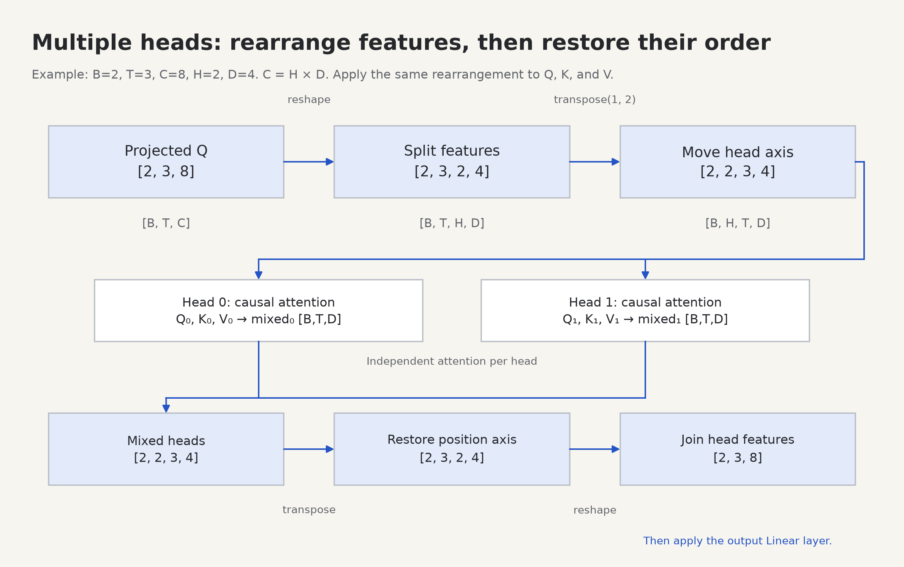

# 6. Multiple heads: several mixtures in parallel

Before this lesson: [attention](05-attention.md). This lesson builds **E03**: turn one attention calculation into several heads and join the results.



## Why have more than one mixture?

One head gives each query one distribution over keys. Multiple heads can compute different distributions at the same time. Different learned projections can expose different relationships. Heads are not assigned jobs like “grammar head” or “subject head”; whether a head develops a useful pattern depends on training.

We split the model's feature width across heads. With `C = 8` total features and `H = 2` heads, each head has `D = C/H = 4` features. Both heads see **all positions**. We divide features, not the sequence.

```text
                 learned Q, K, V projections of ALL input features
                                      │
                               each width = 8
                                      │
                       split output features into heads
                        /                          \
                 head 0: width 4              head 1: width 4
                 attends over T               attends over T
                        \                          /
                           concatenate width 4 + 4
                                      │
                          learned output projection
                                      │
                              output width = 8
```

The projection comes **before** the split. Each head's projected features can depend on all C input features. Splitting raw X first and projecting each slice would impose a different restriction.

## Learn the shape transformation with numbered values

Here is a tensor with one sequence, three positions, and eight features. We will use numbers only to track their positions; these are not trained representations.

```python
import torch

B, T, C, H = 1, 3, 8, 2
D = C // H
x = torch.arange(B * T * C).reshape(B, T, C)
print(x)

split = x.reshape(B, T, H, D)
heads = split.transpose(1, 2)
print(heads.shape)   # torch.Size([1, 2, 3, 4])
print(heads[0, 0])   # head 0 contains features 0..3 of EACH position
```

```text
x [B,T,C]                   heads [B,H,T,D]
position 0:  0  1  2  3 |  4  5  6  7     head 0       head 1
position 1:  8  9 10 11 | 12 13 14 15     0  1  2  3    4  5  6  7
position 2: 16 17 18 19 | 20 21 22 23     8  9 10 11   12 13 14 15
                                        16 17 18 19   20 21 22 23
```

`reshape` splits an axis into axes without changing logical element order. `transpose(1,2)` exchanges the position and head axes. These are distinct operations. Simply reshaping `[B,T,C]` into `[B,H,T,D]` may have the requested size while grouping the wrong numbers.

## Project, split, attend, join, project

The constructor supplies four learned linear layers. They each map C features to C features. Use them in this order:

```python
# Inside MultiHeadAttention.forward: x has shape [B,T,C].
q = self.q_proj(x)
k = self.k_proj(x)
v = self.v_proj(x)
```

For each tensor, make `[B,T,H,D]`, then transpose to `[B,H,T,D]`. Pass all heads together into your E02 function. Because the last two dimensions are the matrix dimensions, PyTorch applies the same attention arithmetic independently to every batch/head pair.

```text
Q                    [B,H,T,D]
K transposed         [B,H,D,T]
scores and weights   [B,H,T,T]
V                    [B,H,T,D]
mixed output         [B,H,T,D]
```

Scale scores by `sqrt(D)`, the **head width**, not `sqrt(C)` or `sqrt(T)`.

To combine the outputs, reverse the earlier axis swap and then join H and D:

```python
joined = heads.transpose(1, 2).contiguous().reshape(B, T, C)
assert torch.equal(joined, x)  # for the numbered tracking example
```

Transposing can produce a tensor whose logical layout no longer follows contiguous memory order. `contiguous()` makes an appropriately ordered copy when needed. `reshape` can also copy when needed; do not replace it with `view` on an arbitrary transposed tensor and assume it will work.

Finally `self.out_proj(joined)` mixes the concatenated head features at each position. Apply the supplied output dropout. With `return_weights=True`, return `(output, weights)` so the inspector can draw a heatmap. Otherwise return only output.

## Cost, without advanced systems terminology

The weights have `B × H × T × T` elements. Doubling sequence length T makes the number of weight entries four times as large. In this explicit implementation those weights are materialized in memory. Optimized attention kernels can avoid storing the full matrix, but the basic dense attention arithmetic still compares position pairs.

Holding C fixed while increasing H decreases D. It does not give every head a full independent C-wide output. With the same four dense projections, changing only H does not change their parameter count, although it changes the attention operation and number of weight entries.

## Your task

Implement E03 in [student.py](../transformer_lab/student.py), using your `scaled_attention`. Start with `B=2,T=3,C=8,H=2`, not the final training dimensions. Write the expected shape in a comment above each operation.

```sh
python -m transformer_lab.check --stage heads
```

Predict before checking:

1. What breaks if C is 10 and H is 3?
2. Can head 0 at position 2 use information from position 0?
3. Why is a tensor with the correct shape not enough evidence of a correct head merge?
4. If two heads receive exactly equal Q/K/V, will their attention outputs differ when dropout is disabled?

<details>
<summary>Answers</summary>

1. This equal-width design requires C to divide evenly into H; the config rejects the mismatch.
2. Yes. Every head includes every position; causality permits earlier positions.
3. A wrong reshape can interleave positions and features while preserving total element count. Track numbered elements, and compare with a separate loop over heads.
4. No. Same input to the same deterministic arithmetic gives the same result. Different learned projections allow different outputs but do not guarantee them.

</details>

Checkpoint: draw one sequence entering two heads, label all axes, and explain why the output still has shape `[B,T,C]`.

Next: [feed-forward networks](07-feedforward.md).
