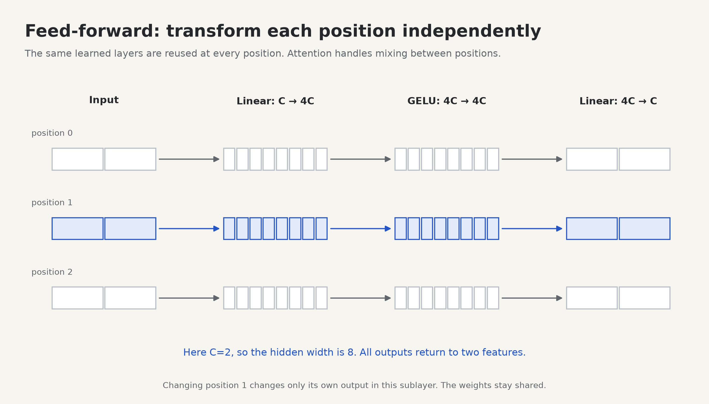

# 7. Feed-forward networks: transform each position's features

Before this lesson: [multiple heads](06-multihead.md). Run `python -m labs.06_feedforward`. You will implement **E04**.



## What does this layer do that attention does not?

Attention has produced a context-informed vector at each position. A feed-forward network, or FFN, applies a learned nonlinear transformation to that vector. **The same FFN weights are reused at every position.** It does not directly read other positions during this operation.

```text
position 0 vector ── Linear → activation → Linear ── output 0
position 1 vector ── Linear → activation → Linear ── output 1
position 2 vector ── Linear → activation → Linear ── output 2
                     same parameters in all rows
```

“Independently” means the FFN computation at position 1 uses only the input vector at position 1. That vector may already contain information from earlier positions because of attention. The complete model is still contextual.

## First linear layer: build combinations of features

A linear layer with bias computes `y = xWᵀ + b` in PyTorch's storage convention. Each output feature is a weighted sum of input features plus a bias. With C input features and F output features, `nn.Linear(C,F)` stores a weight matrix of shape `[F,C]` and a bias of shape `[F]`.

For one position with `x=[2,-1]`, suppose:

```text
W = [ 1  0 ]       b = [0,0,0]
    [ 0  1 ]
    [ 1  1 ]

xWᵀ + b = [2, -1, 1]
```

The layer has created three features from two. Expansion gives the nonlinear stage more intermediate features to transform; it does not necessarily discover three interpretable concepts.

## Activation: make the whole network nonlinear

Without an activation, two affine layers collapse into one affine layer:

```text
(xW₁ᵀ + b₁)W₂ᵀ + b₂
= x(W₂W₁)ᵀ + (b₁W₂ᵀ + b₂)
```

So merely stacking linear layers does not create a nonlinear function. An **activation** acts element by element and changes that.

The lab uses **ReLU** to make hand arithmetic easy: `ReLU(z)=max(0,z)`. It turns `[2,-1,1]` into `[2,0,1]`. The project uses **GELU**, a smooth activation. Its exact mathematical definition is `GELU(z) = z × Φ(z)`, where Φ is the standard normal cumulative distribution function. You do not need to derive Φ: PyTorch implements it in `nn.GELU()`.

```text
input z          -2      -1       0       1       2
ReLU(z)           0       0       0       1       2
GELU(z), approx  -.046   -.159     0      .841   1.954
```

GELU is not a probability distribution and its outputs do not sum to one. It differs from attention's softmax: softmax couples a row of scores, while GELU transforms one element at a time. The PyTorch project uses `nn.GELU()` with its default exact formulation.

## Second linear layer: return to the model width

The transformer keeps width C at block boundaries so residual addition can work. Our FFN expands C to F, applies GELU, then projects F back to C:

```text
[B,T,C=48] → Linear(48,192) → [B,T,192]
           → GELU          → [B,T,192]
           → Linear(192,48)→ [B,T,48]
           → Dropout       → [B,T,48]
```

F is called `d_ff` in the config; we use `F=4C` by default. That multiplier is a design choice, not a mathematical requirement. Some modern models use gated FFNs such as SwiGLU instead; those are an extension after this project.

Dropout randomly sets some activations to zero during training and rescales those kept. `model.eval()` disables it. The default dropout is zero so initial experiments are easier to reproduce. You can try 0.1 later and compare held-out loss.

## Look at the actual PyTorch operation

```python
import torch
from torch import nn

torch.manual_seed(7)
ffn = nn.Sequential(nn.Linear(4, 16), nn.GELU(), nn.Linear(16, 4))
x = torch.randn(2, 3, 4)
y = ffn(x)
print(y.shape)  # torch.Size([2, 3, 4])

x_changed = x.clone()
x_changed[:, 1, :] += 10  # change only position 1 in each sequence
y_changed = ffn(x_changed)
assert torch.allclose(y[:, 0, :], y_changed[:, 0, :])
assert torch.allclose(y[:, 2, :], y_changed[:, 2, :])
```

`nn.Linear` acts on the last axis and preserves all leading axes. There is no loop over tokens in this code because PyTorch applies the same operation over B and T automatically.

The parameter count for two biased linear layers is:

```text
first weights C×F + first bias F + second weights F×C + second bias C
= 2CF + F + C
```

It does not grow when the sequence gets longer. We reuse parameters; we do more computation as we process more positions.

## Build and investigate

The constructor in [student.py](../transformer_lab/student.py) already supplies the layers as `self.net`. Implement E04 by applying that network to X. It is deliberately a small milestone: the important work is understanding the axes and the nonlinear operation. For a deeper exercise, rewrite `nn.Sequential` as separate named layers in a scratch file and get the same output after copying weights.

```sh
python -m transformer_lab.check --stage feedforward
```

1. Change `d_ff` from 192 to 96. What changes in the shapes and parameter count?
2. Remove the activation. Explain why the FFN is now an affine transformation at inference with dropout disabled.
3. Change a future position. Compare FFN outputs with causal attention outputs. Which positions can each operation affect?
4. Does every position have its own private set of FFN weights?

<details>
<summary>Answers</summary>

The intermediate width and parameter count change; the final width stays C. Composing affine maps remains affine. A positionwise FFN changes only the altered position's output. Causal self-attention can change the altered position and later outputs because they can attend to it; earlier outputs remain unchanged. All positions share the same FFN parameters.

</details>

Checkpoint: explain why attention has a `[T,T]` object and a positionwise FFN does not. See the official [Linear](https://docs.pytorch.org/docs/stable/generated/torch.nn.Linear.html) and [GELU](https://docs.pytorch.org/docs/stable/generated/torch.nn.GELU.html) API descriptions for these operations.

Next: [a complete transformer block](08-block.md).
