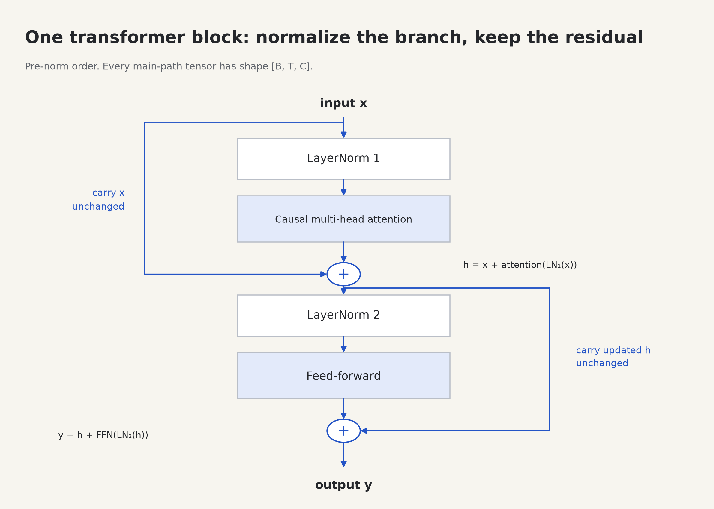

# 8. Residuals, normalization, and a complete block

Before this lesson: [feed-forward networks](07-feedforward.md). You will implement **E05**, then use the same block repeatedly in E06.



## A residual connection keeps the input and adds a change

A residual connection is the expression `x + f(x)`. The branch computes an update, and addition combines that update with the existing representation.

```text
                  ┌────────────── unchanged input ──────────────┐
X [B,T,C] ────────┤                                              + → Y [B,T,C]
                  └─ branch that computes an update [B,T,C] ─────┘
```

If a branch outputs zero, the block can pass the input through unchanged. During backpropagation, the addition also creates a direct path for gradients alongside the path through the branch. This helps optimization; it is not a guarantee that every gradient remains well behaved.

The branch output needs the same shape as X. Attention's output projection and the FFN's second linear layer both return width C for this reason.

## Layer normalization rescales features within one position

Vectors may develop different means and scales as they pass through layers. `nn.LayerNorm(C)` computes statistics over the last C features **separately for each batch item and position**, then learns a scale and offset for each feature.

For a vector with C entries:

```text
mean     μ = sum(x) / C
variance σ² = sum((x - μ)²) / C
normalized = (x - μ) / sqrt(σ² + epsilon)
output = gamma × normalized + beta
```

`epsilon` is a small positive number that prevents division by zero; PyTorch defaults to `1e-5`. `gamma` and `beta` are learned vectors, initialized to ones and zeros. The elementwise multiplication by gamma is not a matrix product.

For `[1,3]`, mean is 2, variance is 1, and the normalized vector is approximately `[-1,1]`. A constant vector normalizes to zeros before the learned offset. Because of epsilon and the learned affine transform, do not assert that every LayerNorm output always has exactly unit variance or zero mean.

```python
import torch
from torch import nn

x = torch.tensor([[[1., 3.], [10., 14.]]])  # [B=1,T=2,C=2]
norm = nn.LayerNorm(2)
print(norm(x))  # each position is normalized using its OWN two features
```

We do not normalize across T. Mixing statistics across future positions could leak information in a causal model. LayerNorm also does not keep running batch statistics: it computes its statistics from the current input in both training and evaluation.

## Wire the block precisely

Our project uses **pre-normalization**: normalize the input to each branch before running attention or the FFN. The residual stream itself bypasses that normalization.

```text
X ────────────────┬───────────────────────────────────────┐
                 │                                       │
                 └→ LayerNorm 1 → causal multihead attn ──+ → A
                                                         │
A ────────────────┬───────────────────────────────────────┤
                 │                                       │
                 └→ LayerNorm 2 → feed-forward ───────────+ → Y
```

Equations with distinct intermediate names:

```text
A = X + Attention(LayerNorm₁(X))
Y = A + FFN(LayerNorm₂(A))
```

Pay attention to A in the second equation. The FFN sees the representation **after** the attention update. If both branches use the original X, you have implemented different wiring.

The original 2017 transformer used a different normalization placement and an encoder–decoder architecture. This small teaching model uses a common decoder-only, pre-norm arrangement with GELU and learned position embeddings. It demonstrates the core operations; it is not an exact recreation of that paper or a particular commercial model.

## Stacking blocks

```text
IDs [B,T]
   ↓ token embedding + position embedding
X [B,T,C]
   ↓ block 0 (its own learned parameters)
   ↓ block 1 (a different set of learned parameters)
   ↓ final LayerNorm
   ↓ Linear(C,vocabulary size)
logits [B,T,V]
```

A **logit** is an unconstrained score for one possible next token. Higher logits become higher probabilities after softmax. Logits can be positive or negative and need not sum to one.

`nn.ModuleList` registers each block as part of the model. That ensures `model.parameters()`, saving, loading, and train/eval mode changes can find the blocks. A plain Python list does not register submodules in the same way. The constructor supplies a proper ModuleList for you.

Each block can combine earlier information into more context-dependent features. At every layer, the causal mask still forbids access to future positions. Final LayerNorm and the output linear layer operate separately per position, so they preserve that property.

## Implement and test

Implement E05's two residual updates in [student.py](../transformer_lab/student.py). Keep X's original branch in each addition. The attention and FFN modules already include output dropout; do not add softmax to their outputs.

```sh
python -m transformer_lab.check --stage block
```

Then sketch E06: embed IDs, run every block in order, apply final normalization, and project to vocabulary logits. Do not softmax those logits inside the model; the loss expects raw scores.

Checkpoint experiments:

1. If both branches return zeros, what does the block return?
2. Does `nn.LayerNorm(C)` average across other examples in the batch?
3. Which parts of the block have learned parameters?
4. Is `x + f(norm(x))` the same as `norm(x + f(x))`?

<details>
<summary>Answers</summary>

The block returns X when both branch outputs are zero. LayerNorm(C) uses only the current position's C features. Q/K/V/output projections, FFN linear layers, and LayerNorm gamma/beta are learned; residual addition, masking, softmax, and the head reshapes have no stored learned weights of their own. Pre-norm and post-norm are different functions with different training behavior.

</details>

The normalization definition matches [PyTorch LayerNorm](https://docs.pytorch.org/docs/stable/generated/torch.nn.LayerNorm.html). The architecture comparison is grounded in [the original transformer paper](https://arxiv.org/abs/1706.03762).

Next: [training and generation](09-training.md).
