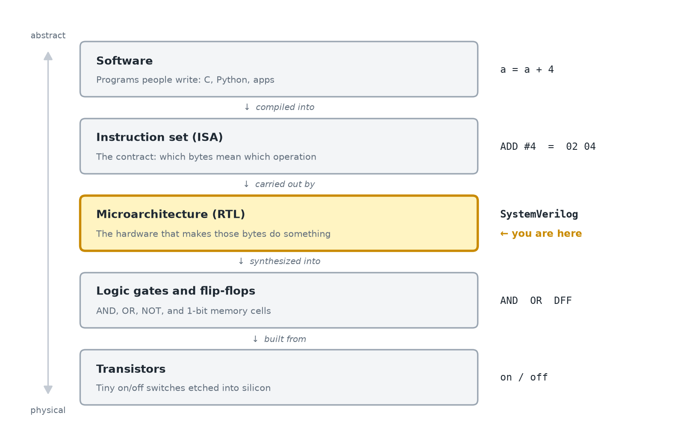
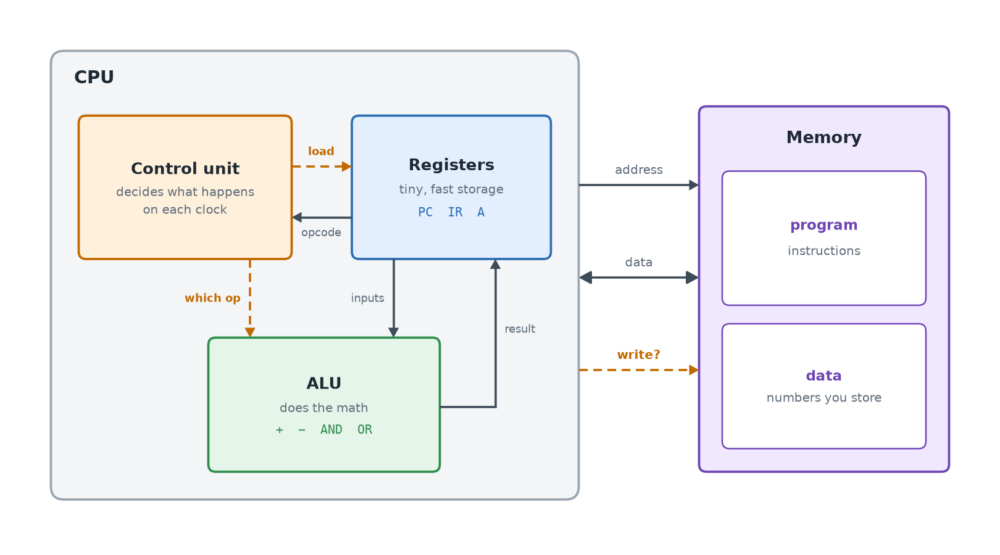
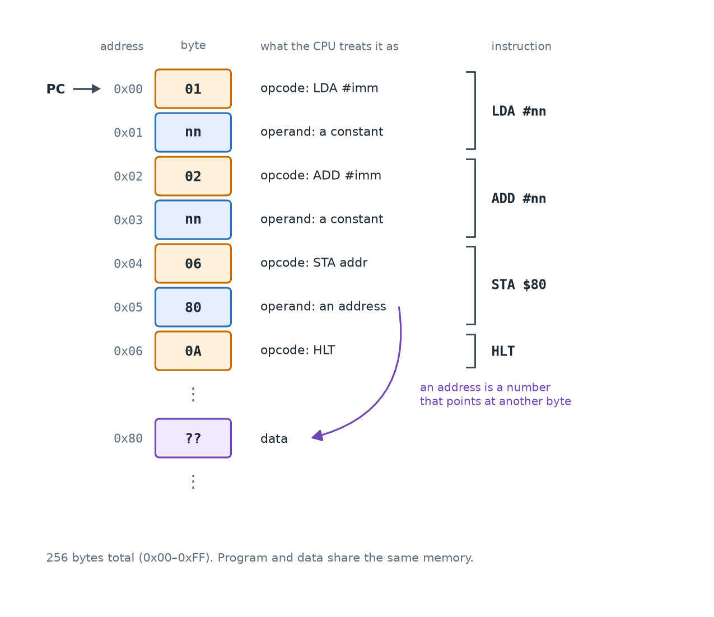
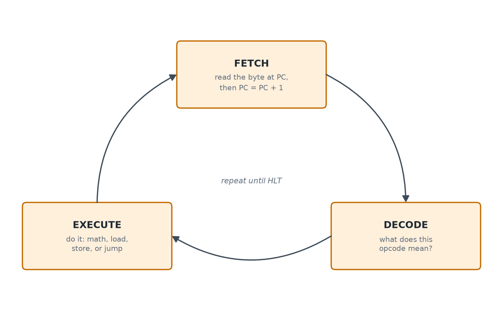
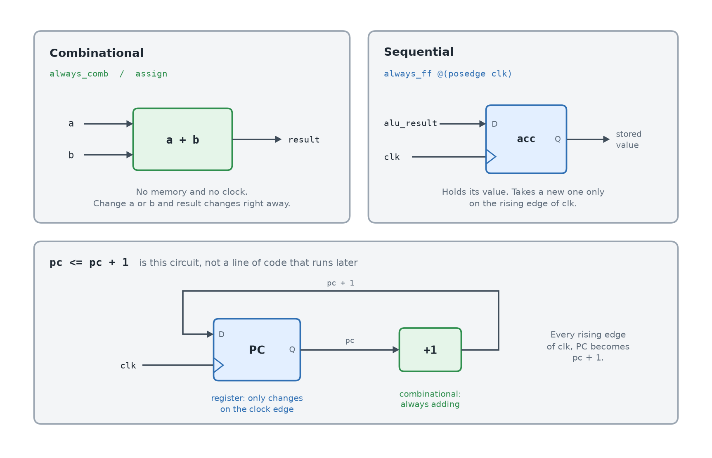
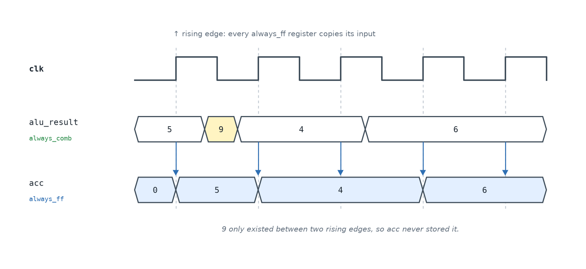
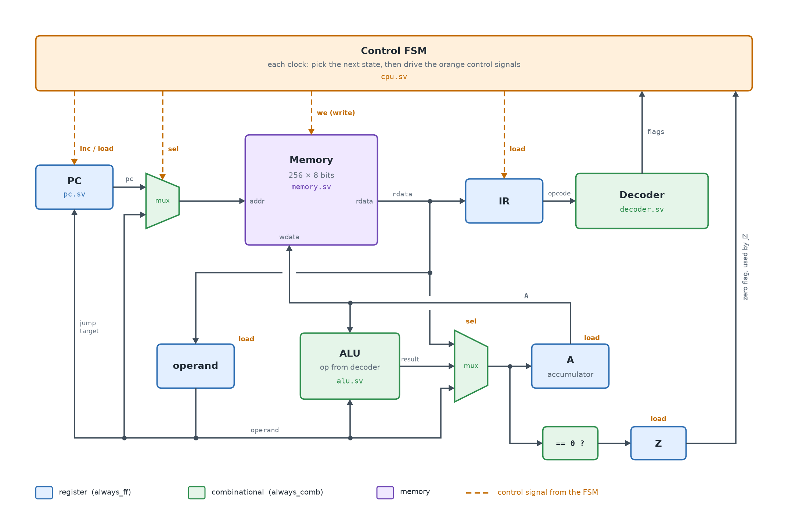
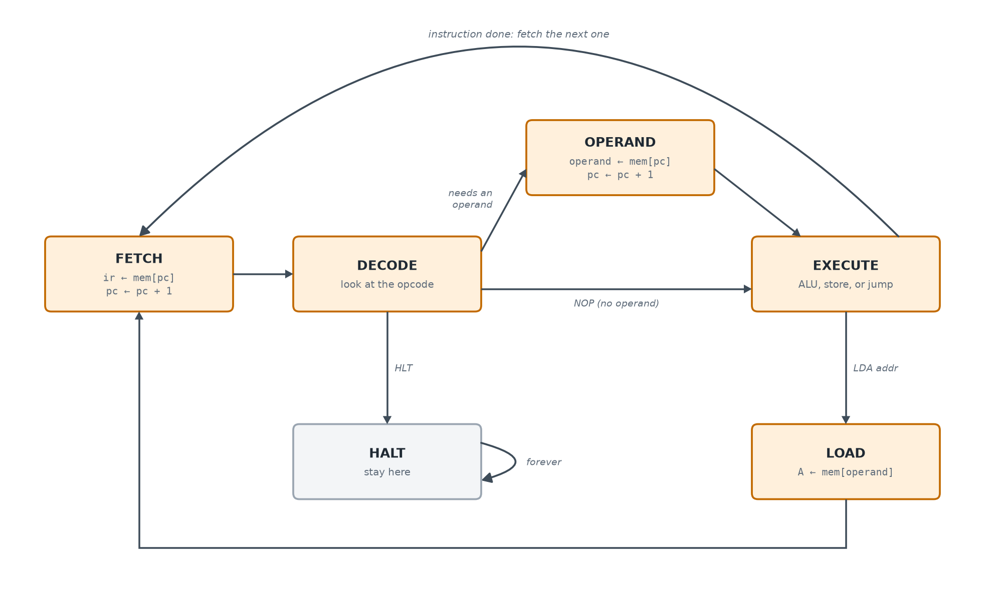
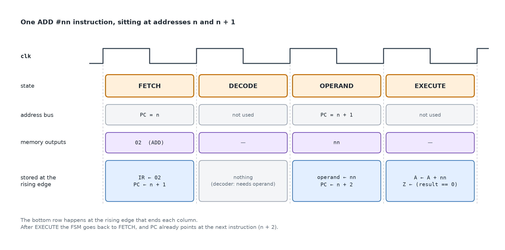

# How a processor works

A processor does one thing. It reads a number from memory, treats that number
as an instruction, carries it out, and moves on to the next one. Everything a
computer does, from a calculator to a web browser, is that loop running
billions of times a second.

This guide builds up that loop from the basics, then shows how Tiny8, the CPU
in this folder, implements it. Read it before `README.md`, which covers what
you will write.

---

## 1. Where this sits



A computer is built in layers. Each layer hides the details of the one below.

- **Software** is what most programmers write. A compiler turns it into
instructions.
- The **instruction set architecture (ISA)** is the contract between software
and hardware. It says which bytes mean which operation. In Tiny8, the bytes
`02 04` mean "add 4 to the accumulator, called A."
- The **microarchitecture** is the hardware that keeps that contract: the
registers, the adder, and the logic that steps through instructions. You
describe it in SystemVerilog, at what is called the register-transfer level
(RTL).
- A **synthesis** tool turns RTL into **logic gates and flip-flops**, which are
made of **transistors**.

This project lives in the highlighted layer. You pick the instruction set (it
is in `src/cpu_pkg.sv`), then build the hardware that carries it out.

---

## 2. The parts of a computer



Nearly every processor has the same three parts inside.

**Registers** are a few tiny, fast storage slots inside the CPU. Tiny8 has
three that matter:


| Name   | Stands for           | What it holds                                                                                                                                                                              |
| ------ | -------------------- | ------------------------------------------------------------------------------------------------------------------------------------------------------------------------------------------ |
| **PC** | program counter      | The address of the next byte to read. After a read it usually becomes the next address, one higher. A jump replaces it with some other address, which is how the CPU skips ahead or loops. |
| **IR** | instruction register | The opcode, the byte that names the instruction, being carried out right now.                                                                                                              |
| **A**  | accumulator          | The one number the CPU is working on. Loads put a value here, adds change it, and stores copy it out to memory.                                                                            |


The **ALU** (arithmetic logic unit) does the math: add, subtract, AND, OR. It
takes inputs from registers and hands back a result.

The **control unit** is the conductor. It looks at the current instruction
and, on each clock, decides which registers load a new value, which operation
the ALU does, and whether memory is read or written.

Outside the CPU is **memory**, a long row of numbered slots. A **byte** is one
slot: 8 bits, so a number from 0 to 255. An **address** is the number of a
slot, starting at 0. The CPU talks to memory over three sets of wires. The
**address** says which byte. The **data** carries the byte in or out. **Write**
says whether this is a store.

Real computers also have input and output devices, like a keyboard or a
screen. Tiny8 has none. The testbench looks into memory instead.

---

## 3. Instructions are just numbers



Memory holds nothing but bytes. A byte becomes an instruction only because PC
points at it and the CPU reads it as one.

A Tiny8 instruction is one or two bytes:

- The first byte is the **opcode**, short for operation code. It is a number
that names the instruction. The CPU never sees the letters `LDA` or `ADD`.
It sees `01` or `02` and treats that number as the operation.
- The second byte, if there is one, is the **operand**. Depending on the opcode
it is either a constant (`#nn`) or an address (`$80`) that points at another
byte in memory.


| Opcode | Name       | What it does                                                     |
| ------ | ---------- | ---------------------------------------------------------------- |
| `00`   | `NOP`      | Do nothing, then fetch the next instruction.                     |
| `01`   | `LDA #nn`  | Load the accumulator: `A` becomes the constant in the next byte. |
| `02`   | `ADD #nn`  | Add the next byte to `A`.                                        |
| `03`   | `SUB #nn`  | Subtract the next byte from `A`.                                 |
| `04`   | `AND #nn`  | Bitwise AND of `A` and the next byte.                            |
| `05`   | `OR #nn`   | Bitwise OR of `A` and the next byte.                             |
| `06`   | `STA addr` | Store `A` into memory at the address in the next byte.           |
| `07`   | `LDA addr` | Load `A` from memory at the address in the next byte.            |
| `08`   | `JMP addr` | Jump: set PC to the address in the next byte.                    |
| `09`   | `JZ addr`  | Jump to that address only if the zero flag is set.               |
| `0A`   | `HLT`      | Halt. The CPU stays stopped.                                     |


`#nn` means the operand is a constant, also called an **immediate**. `addr`
means the operand is a memory address. `LDA` is "load accumulator," `STA` is
"store accumulator," `JMP` is "jump," `JZ` is "jump if zero," and `HLT` is
"halt." `NOP` is "no operation." **AND** and **OR** work bit by bit: each bit
of A is combined with the matching bit of the operand, and the other bits are
left alone.

The **zero flag (Z)** is a single bit that turns on when the last value written
into A was 0, and off otherwise. `JZ` reads that bit to decide whether to jump.

Programs and data share the same memory. This is called the stored-program, or
von Neumann, design, and nearly every computer uses it. It also means that if
PC ever wanders into your data, the CPU will happily try to run it.

---

## 4. The fetch–decode–execute cycle



This is the loop every processor runs.

1. **Fetch.** Put PC on the address wires, read the byte that comes back, and
  store it in IR. Add 1 to PC so it points at the next byte.
2. **Decode.** Look at the opcode in IR and work out what it needs. Another
  byte? The ALU? A memory write? A jump?
3. **Execute.** Do it. Put a result in A, write A to memory, or load a new
  value into PC.

Then go back to fetch. PC already moved forward, so the next fetch picks up
the next instruction. A jump is nothing more than writing a new value into
PC, so the next fetch happens somewhere else.

---

## 5. Two kinds of hardware



Every digital circuit is built from two kinds of pieces, and SystemVerilog has
a keyword for each.

**Combinational logic** (`always_comb`, `assign`) is gates wired together. It
has no memory. Its output depends only on its inputs right now, so when an
input changes, the output follows. There is no "wait until later." The ALU,
the decoder, and the muxes are combinational.

`assign sum = a + b;` and an `always_comb` block both describe that kind of
circuit. The `=` inside them is a wire, not a step in a program. Change `a`
and `sum` is already the new total.

**Sequential logic** (`always_ff @(posedge clk)`) is built from flip-flops,
which remember a value. `**clk**` is the clock: a wire that flips between 0
and 1 forever. `**posedge**` means the rising edge, the instant `clk` goes
from 0 to 1. A register ignores its input until that instant, then copies the
input and holds it until the next rise. PC, IR, A, Z, and the FSM state are
sequential.

```systemverilog
always_ff @(posedge clk) begin
  pc <= pc + 1;
end
```

Read `@(posedge clk)` as "only when the clock rises." The `<=` here is not a
comparison. Inside `always_ff` it means "store this into the register on that
edge."


|                | Combinational               | Sequential                  |
| -------------- | --------------------------- | --------------------------- |
| SystemVerilog  | `assign`, `always_comb`     | `always_ff @(posedge clk)`  |
| Memory         | none                        | holds a value               |
| Output changes | as soon as an input changes | only when `clk` rises       |
| In Tiny8       | ALU, decoder, muxes         | PC, IR, A, Z, the FSM state |


The bottom of the diagram shows how the two fit together. `pc <= pc + 1`
describes a register whose output runs through a +1 adder and back into its
own input. The adder is always adding. The register only takes the new value
on a clock edge, so PC goes up by exactly one per clock.

Most of a CPU is that pattern repeated: registers feed combinational logic,
and that logic computes what the registers should hold after the next edge.

---

## 6. The clock



The clock is a signal that flips between 0 and 1 forever. The moment it goes
from 0 to 1 is the **rising edge**, and that is the only moment registers
change.

In the diagram, `alu_result` is combinational. It changes whenever its inputs
do: 5, then 9, then 4, then 6. `acc` is a register. On each rising edge it
copies whatever `alu_result` is at that instant. The 9 came and went between
two edges, so `acc` never saw it.

That is the whole point of a clock. Combinational logic can wiggle and settle
between edges, and only the settled value gets stored.

The clock also sets a CPU's speed. The time between edges has to be longer
than the slowest path through the combinational logic, or a register would
store a half-finished result. A 3 GHz processor is one whose slowest path
settles in under a third of a nanosecond.

---

## 7. Datapath and control: Tiny8 up close



A CPU design splits into two halves.

- The **datapath** is where numbers flow: registers, the ALU, memory, and the
wires between them.
- The **control** is the FSM at the top. It never touches the numbers. Each
clock it sets the orange signals: which input each mux passes through, which
registers load, and whether memory writes.

Things to trace in the picture:

- **Muxes** (the trapezoids) are switches that pick one of several inputs. The
address mux picks PC while reading the program, or the operand when an
instruction reads or writes data. The A mux picks whether A gets the
operand, the ALU result, or a byte loaded from memory.
- Memory's `rdata` (the byte just read) goes to three places: IR during fetch,
the operand register during the operand step, and A during a load. The
control signals decide which one actually stores it.
- The operand also goes several places: the ALU, the A mux, the address mux
(for `STA` and `LDA addr`), and PC as a jump target.
- A feeds the ALU and memory's `wdata` (the byte to write). That is how `STA`
stores it.
- Z remembers whether the last value written into A was zero. The FSM reads it
to decide whether `JZ` jumps.

Where each block lives:


| Block                                 | File             | Kind                        |
| ------------------------------------- | ---------------- | --------------------------- |
| PC                                    | `src/pc.sv`      | register                    |
| Memory                                | `src/memory.sv`  | memory                      |
| Decoder                               | `src/decoder.sv` | combinational               |
| ALU                                   | `src/alu.sv`     | combinational               |
| IR, operand, A, Z, muxes, control FSM | `src/cpu.sv`     | registers and combinational |
| CPU wired to memory                   | `src/tiny8.sv`   | wiring only                 |


---

## 8. The control FSM



A **finite state machine** (FSM) is a register that holds "which step am I
on," plus combinational logic that picks the next step. Tiny8's FSM has six
states, and each one lasts one clock.

- **FETCH** loads the opcode into IR and moves PC forward.
- **DECODE** looks at the opcode. `HLT` goes to HALT. An instruction with a
second byte goes to OPERAND. `NOP` goes straight to EXECUTE.
- **OPERAND** loads the second byte and moves PC forward again.
- **EXECUTE** does the work, then usually goes back to FETCH.
- **LOAD** is an extra clock used only by `LDA addr`. EXECUTE points the
address at the operand, and LOAD copies the byte that comes back into A.
With Tiny8's simple memory you could squeeze both into EXECUTE. Keeping them
apart gives each state one job.
- **HALT** stays put forever. The testbench watches for it to know the program
finished.

---

## 9. One instruction, clock by clock



This traces one `ADD #nn` stored at addresses n and n + 1. It takes four
clocks.

Nothing gets stored in the middle of a column. Everything in the bottom row
happens at the rising edge that ends that column, all at once. Read the
columns left to right and you are watching the FSM, the address mux, memory,
and the registers work together. When `make sim` prints its cycle-by-cycle
trace, this is what it is showing you.

---

## 10. How real CPUs go faster

Tiny8 is a multi-cycle design: one instruction at a time, several clocks each.
Real processors keep the same fetch–decode–execute idea and add tricks on top.

- **Pipelining** overlaps instructions. While one executes, the next is
decoding and the one after that is being fetched, like an assembly line.
- **More registers.** A register file with 16 or 32 registers means far fewer
trips to memory than a single accumulator.
- **Caches** are small, fast memories next to the CPU that keep recently used
bytes close, because main memory is slow.
- **Branch prediction** guesses which way a jump will go, so the pipeline does
not have to stop and wait.
- **Superscalar and out-of-order execution** run several instructions per
clock and reorder them when they do not depend on each other.

Every one of these is a change to the microarchitecture. The ISA, and the
software written for it, can stay the same.

---

## Words you will see


| Term                    | Meaning                                                                                                                 |
| ----------------------- | ----------------------------------------------------------------------------------------------------------------------- |
| **CPU**                 | The processor. It fetches instructions and carries them out.                                                            |
| **Memory**              | A long row of bytes, shared by the program and its data.                                                                |
| **Byte**                | One memory slot. 8 bits, a number from 0 to 255.                                                                        |
| **Address**             | The number of a byte in memory. Address 0 is the first byte.                                                            |
| **PC**                  | Program counter. The address of the next byte to fetch.                                                                 |
| **IR**                  | Instruction register. Holds the opcode being carried out.                                                               |
| **A**                   | Accumulator. Tiny8's one working number.                                                                                |
| **Z**                   | Zero flag. On when the last value written into A was 0.                                                                 |
| **ALU**                 | Arithmetic logic unit. Adds, subtracts, ANDs, and ORs.                                                                  |
| **Opcode**              | Operation code. The first byte of an instruction: a number that says what to do, such as `01` for load or `02` for add. |
| **Operand**             | The optional second byte: a constant (`#nn`) or an address.                                                             |
| **Immediate**           | An operand that is the number itself, not an address.                                                                   |
| **clk**                 | The clock wire. It flips between 0 and 1. `posedge clk` is the moment it rises, which is when registers update.         |
| **Rising edge**         | The moment the clock goes from 0 to 1.                                                                                  |
| **Register**            | A group of flip-flops that holds a value between clocks.                                                                |
| **Flip-flop**           | A one-bit memory cell that updates on the rising edge.                                                                  |
| **Combinational logic** | Gates with no memory. The output follows the inputs immediately.                                                        |
| **Sequential logic**    | Flip-flops. The output changes only on a clock edge.                                                                    |
| **Mux**                 | Multiplexer. A switch that passes one of several inputs through.                                                        |
| **Bus**                 | A group of wires that carries one value, such as an 8-bit address.                                                      |
| **Datapath**            | The registers, ALU, memory, and wires that the numbers flow through.                                                    |
| **Control unit**        | The logic that, each clock, decides what the datapath should do.                                                        |
| **FSM**                 | Finite state machine. A register that holds the current step, plus logic that picks the next one.                       |
| **ISA**                 | Instruction set architecture. The list of opcodes and what each one must do.                                            |
| **RTL**                 | Register-transfer level. Hardware described as registers and the logic between them.                                    |
| **Synthesis**           | Turning RTL into gates for an FPGA or a chip.                                                                           |
| **Testbench**           | Simulation-only code that drives the design and checks the result.                                                      |


---

## Next

Open `[README.md](README.md)` for the file-by-file plan, then start with
`src/alu.sv`.

The diagrams are drawn by `[utils/make_diagrams.py](../../utils/make_diagrams.py)`
at the repo root. If you change the design, you can edit that script and redraw them.