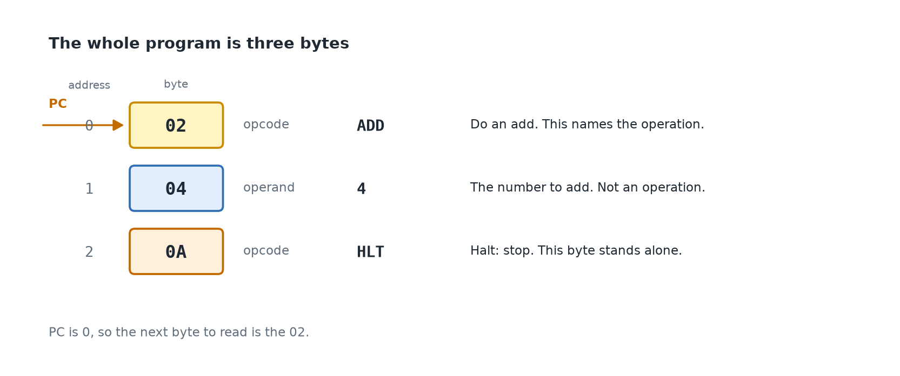
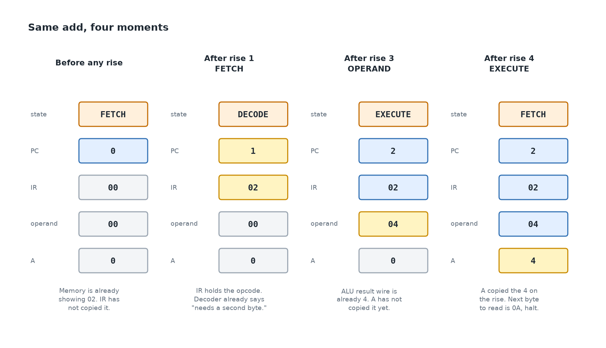

# One instruction, slowly

`intro.md` names the parts. `README.md` asks you to build them. This page is
the step between those two: one tiny program, and what sits in PC, IR, A, and
the operand after each rise of the clock.

Leave the `.sv` files as they are while you read this. The skeleton still has
empty TODOs. The story below is the finished machine, so you can see what
those TODOs are aiming at.

---

## The words, once more

Five names show up in every row below. Each one is a place a number sits, or a
number itself.

| Name | What it is, in this program |
| --- | --- |
| **Address** | The slot number in memory. Slots are numbered 0, 1, 2, … |
| **Byte** | The number stored in that slot. Here those numbers are `02`, `04`, and `0A`. |
| **Opcode** | A byte the CPU reads as the operation. `02` means add. `0A` means halt. |
| **Operand** | The extra byte an operation uses. For this add, `04` is the number 4. |
| **PC** | The address of the next byte to read. It starts at 0, so the first read is `02`. |
| **IR** | The opcode just copied in. Empty until a fetch stores one. |
| **A** | The accumulator. The number being added to. It starts at 0. |
| **HLT** | Halt. Opcode `0A`. The CPU stops. This instruction is one byte, with no operand. |

A **rise** is the instant `clk` goes from 0 to 1. Registers copy a new value
only then. Between rises they hold still.

---

## The program

Three bytes in memory. A starts at 0. The program adds 4, then stops.

| Address | Byte | What that byte is |
| --- | --- | --- |
| 0 | `02` | The opcode `ADD`. "Add a number to A." |
| 1 | `04` | The operand. The number to add, which is 4. |
| 2 | `0A` | The opcode `HLT`. "Stop." It has no second byte. |

Read address 0 and address 1 together: `02 04` is one instruction, add 4.
Address 2 is the next instruction, stop. The `04` is not an opcode. It is the
4 that gets added. The `0A` is not data for the add. It is a new instruction
that runs after the add finishes.

---

## What is already true before the first rise

Reset has run. The registers hold:

| Place | Value | Why |
| --- | --- | --- |
| PC | 0 | Next byte to read is address 0. |
| IR | `00` | No opcode stored yet. |
| operand | `00` | No second byte stored yet. |
| A | 0 | Nothing has been added yet. |
| state | FETCH | The step the machine is on. |

The address wires already show PC, so they show 0. Memory is combinational
on a read: the byte at address 0, `02`, is already sitting on the data wires.
Nothing has copied it into IR. Copying waits for the clock to rise.

That split is the whole CPU. Gates put the right number on a wire
immediately. A register copies that wire only when `clk` rises.

---

## Rise by rise

Each row is one rise of `clk`. The numbers in PC, IR, operand, and A are what
those registers hold **after** that rise. Yellow in the picture is what just
changed.

| Rise | State we were in | What gets stored | PC | IR | operand | A | Next state |
| --- | --- | --- | --- | --- | --- | --- | --- |
| 1 | FETCH | the byte at address 0, which is `02` | 1 | `02` | `00` | 0 | DECODE |
| 2 | DECODE | only the next step | 1 | `02` | `00` | 0 | OPERAND |
| 3 | OPERAND | the byte at address 1, which is `04` | 2 | `02` | `04` | 0 | EXECUTE |
| 4 | EXECUTE | the ALU result into A | 2 | `02` | `04` | 4 | FETCH |
| 5 | FETCH | the byte at address 2, which is `0A` | 3 | `0A` | `04` | 4 | DECODE |
| 6 | DECODE | only the next step | 3 | `0A` | `04` | 4 | HALT |

After rise 6 the machine stays in HALT. A is 4. That is the program finished.

### Rise 1 — FETCH

PC is 0, so memory is showing `02`. On the rise, IR copies that byte and PC
becomes 1. IR now holds the opcode of the instruction being carried out.

As soon as IR holds `02`, the decoder changes. It is `always_comb`, so it
does not wait for another clock. Its wires now say: this opcode needs a
second byte, and the ALU should add.

### Rise 2 — DECODE

Decode looks at those wires and picks the next step. `02` needs an operand,
so the next state is OPERAND. A is still 0. The add has not happened. Decode
only chooses a path.

### Rise 3 — OPERAND

PC is 1, so memory is showing `04`. On the rise, the operand register copies
`04`, and PC becomes 2.

Now the ALU's two inputs are A (still 0) and the operand (4). The ALU is
`always_comb`, so its result wire is already 4. A has not copied it yet.

### Rise 4 — EXECUTE

On the rise, A copies the ALU result. A becomes 4. The state goes back to
FETCH. PC is 2, so the next byte memory is showing is `0A`, halt.

### Rises 5 and 6 — halt

FETCH stores `0A` in IR. The decoder wire `is_halt` turns on immediately.
The next rise, DECODE, sends the state to HALT. Later rises do nothing.

---

## The same shape, with a different instruction

Load the constant 7 into A, then stop. The bytes are `01 07 0A`.

| Address | Byte | What that byte is |
| --- | --- | --- |
| 0 | `01` | Opcode `LDA #nn`. "Put the next byte into A." |
| 1 | `07` | The operand. The constant 7. |
| 2 | `0A` | Opcode `HLT`. Stop. |

| After this rise | PC | IR | operand | A | Why |
| --- | --- | --- | --- | --- | --- |
| FETCH | 1 | `01` | `00` | 0 | IR copied the opcode. A is still 0. |
| DECODE | 1 | `01` | `00` | 0 | `01` needs a second byte, so the next step is OPERAND. |
| OPERAND | 2 | `01` | `07` | 0 | The operand register copied 7. A has not. |
| EXECUTE | 2 | `01` | `07` | 7 | `LDA #nn` copies the operand straight into A. No ALU. |
| FETCH, then DECODE | 3 | `0A` | `07` | 7 | `0A` means halt, same as before. |

`01 07` and `02 04` are the same shape: opcode, then operand, then later a
halt. The opcode is what changes the work. `01` copies the operand into A.
`02` adds the operand to A. `0A` stops, and it has no operand byte at all.

---

## Where each of those lives

| What you watched | File | Kind |
| --- | --- | --- |
| The byte memory was showing | `src/memory.sv` | a read is combinational; a store waits for the clock |
| IR holding `02`, A becoming 4, the step name | `src/cpu.sv` | registers, updated with `always_ff @(posedge clk)` |
| "this opcode needs a second byte and an add" | `src/decoder.sv` | `always_comb`. Input is the opcode in IR. |
| The result wire that was already 4 | `src/alu.sv` | `always_comb`. Inputs are A and the operand. |
| PC going 0, 1, 2, 3 | `src/pc.sv` | a register that adds 1 on a fetch or an operand read |
| CPU wires plugged into memory | `src/tiny8.sv` | wiring only |
| The three bytes, and the clock flipping | `tb/cpu_tb.sv` | the lab bench, not part of the chip |

`src/cpu_pkg.sv` is the list of names: `02` is called `ADD_IMM`, the steps
are called `S_FETCH`, `S_DECODE`, and so on.

---

## What the first file is, when you want it

`src/alu.sv` is only the result wire from rise 3. It never sees PC, IR, or
`clk`. Someone puts two numbers on `a` and `b`, and puts an operation on
`op`. `result` becomes the sum, difference, AND, or OR in that same moment.
`zero` is 1 when that result is 0.

The testbench `tb/alu_tb.sv` is a hand poking those inputs. `make sim-alu`
runs that hand. It does not run the six rises above.

`README.md` is the order to build the boxes. This page is the reason that
order starts with the ALU: it is the one box whose story is a single wire.
